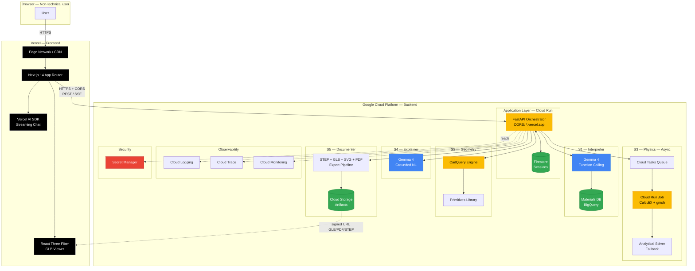
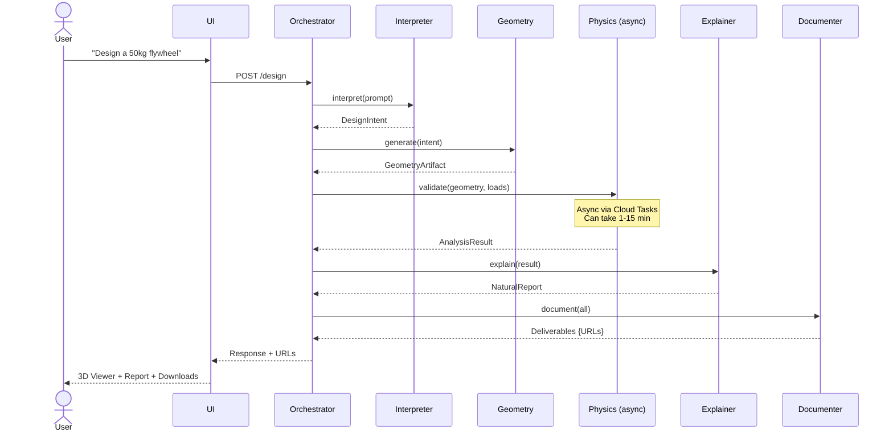
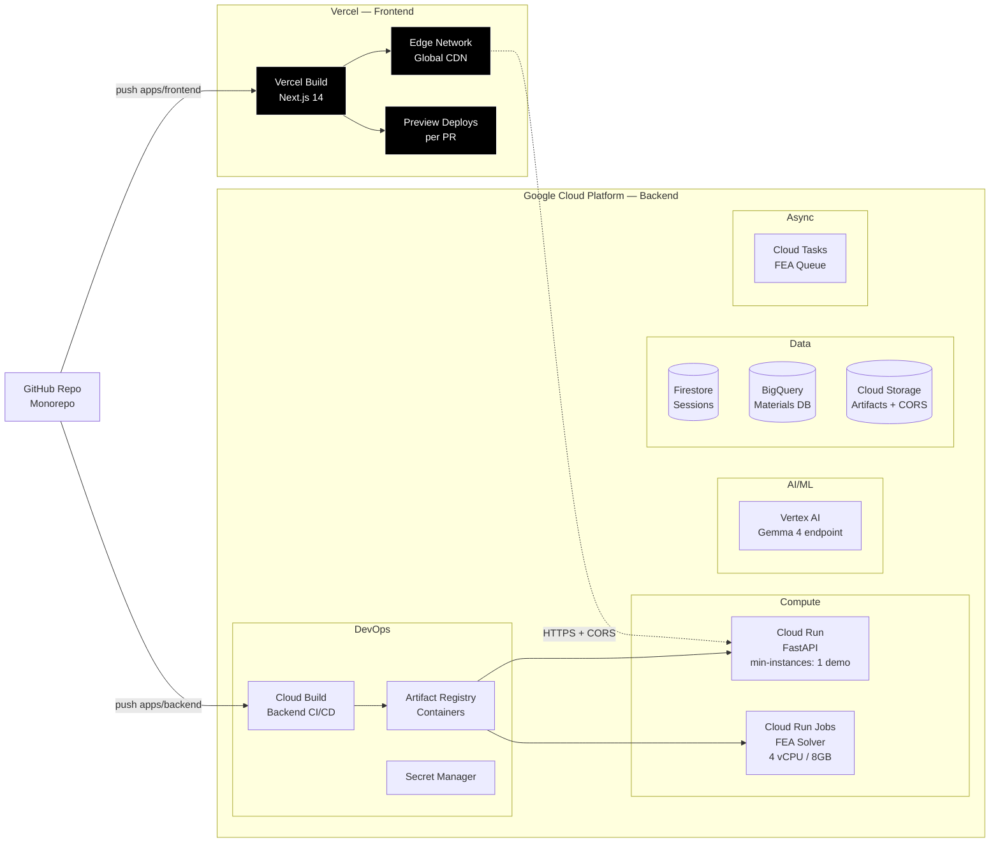
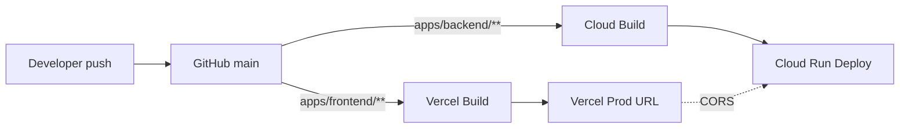

# AI-Driven Mechanical Design for All

**Hackathon**: Gemma 4 Good — Submission 2026-05-18
**Scoring**: 40 Impact/Vision + 30 Storytelling + 30 Technical Depth
**Strategy**: Solid technical MVP + outstanding storytelling + 1 polished hero demo + 2 functional ones

---

## 1. System Vision

Platform that turns a natural-language idea into a **physically validated technical blueprint**, accessible to non-engineers. Decomposed into **5 small, independent subsystems**, each with a clear interface and a single responsibility.

Design principle: **every subsystem must be replaceable without affecting the others** (Hexagonal / Ports & Adapters).

---

## 2. Small-Systems Architecture

Each subsystem is a logical microservice with a well-defined input/output contract.

### S1 — Interpreter Service

| | |
|---|---|
| **Responsibility** | Convert Spanish/English text into a structured `DesignIntent` |
| **Input** | `{ prompt: string, conversation_id: string }` |
| **Output** | `DesignIntent { type, dimensions, material, loads, constraints }` |
| **Technology** | Gemma 4 via Vertex AI + function calling |
| **Validation** | JSON schema + plausible physical ranges |
| **Fallback** | Clarifying questions when confidence < 0.8 |

### S2 — Geometry Service

| | |
|---|---|
| **Responsibility** | Materialize `DesignIntent` into parametric 3D geometry |
| **Input** | `DesignIntent` |
| **Output** | `GeometryArtifact { brep, mesh, bbox, mass_properties }` |
| **Technology** | CadQuery / build123d + in-house primitives library |
| **Primitives** | `Shaft`, `Plate`, `Flange`, `Gear`, `Flywheel_Rim`, `Bearing_Housing`, `Hinge_Panel` |
| **Fallback** | Simplified geometry when composition fails |

### S3 — Physics Service

| | |
|---|---|
| **Responsibility** | Structural / dynamic analysis of the geometry |
| **Input** | `GeometryArtifact + LoadCase` |
| **Output** | `AnalysisResult { stress_field, displacement, safety_factor, verdict }` |
| **Technology** | CalculiX (FEA) + gmsh (mesh) + analytical formulas |
| **Execution** | Async via Cloud Tasks → Cloud Run Job (15 min timeout) |
| **Fallback** | Classical analytical solution when geometry allows (disk, beam, plate) |

### S4 — Explainer Service

| | |
|---|---|
| **Responsibility** | Translate numerical results into accessible natural language |
| **Input** | `AnalysisResult + DesignIntent` |
| **Output** | `NaturalReport { summary, risks, suggestions, analogies }` |
| **Technology** | Gemma 4 with strict grounding (temperature 0.3) |
| **Rule** | NARRATES only real numerical data; fabricating values is forbidden |

### S5 — Documenter Service

| | |
|---|---|
| **Responsibility** | Export professional deliverables + web viewer asset |
| **Input** | `GeometryArtifact + AnalysisResult + NaturalReport` |
| **Output** | `Deliverables { step_file, glb_file, pdf_drawing, svg_2d, report_pdf }` |
| **Technology** | build123d `export_gltf()` for GLB (viewer) + STEP AP214 (CAD download) + reportlab (PDF) + native SVG |
| **Storage** | Cloud Storage with signed URLs (24h), CORS enabled for `*.vercel.app` |

---

## 3. Component Diagram



### Full request flow



---

## 4. Use Cases — Hero Demos as Small Systems

Each hero demo is a **composition** of the 5 subsystems with specific parametrization. Prioritized by technical risk and narrative value.

### Hero #1 — Flywheel (Energy Recovery)

**Priority**: ROBUST. Low risk, high technical wow factor.

| Aspect | Detail |
|---|---|
| **User story** | *"I need a flywheel to store 500 kJ at 3000 RPM"* |
| **Geometry** | Axisymmetric: disk with mass concentrated at the rim |
| **Primitives** | `Flywheel_Rim(outer_r, inner_r, thickness)` + `Shaft` + `Bearing_Housing` |
| **Physics** | Centrifugal stress σ = ρω²r²/2 (analytical) + 2D axisymmetric FEA |
| **Validation** | Safety factor ≥ 2 against material yield |
| **Export** | STEP (3D) + PDF with section views + energy report |
| **Video narrative** | "Energy that is never lost" — scenario: regeneration in trains |

### Hero #2 — Modular Hydroelectric Generator

**Priority**: FUNCTIONAL. Maximum impact on the "Global Resilience" track.

| Aspect | Detail |
|---|---|
| **User story** | *"I have a river with 5 m³/s flow and 20m head. What generator can I build?"* |
| **Geometry** | Composition: simplified Pelton runner + shaft + housing + modular base |
| **Primitives** | `Pelton_Runner` + `Shaft` + `Housing` + `Mounting_Frame` |
| **Physics** | Theoretical power P = ρgQHη + shaft stresses (torsion + bending) |
| **Validation** | Shaft sizing by strength + FEA verification |
| **Export** | Assembled STEP + bill of materials + assembly drawing |
| **Video narrative** | "Rural communities generating their own energy" |

### Hero #3 — Foldable Emergency Shelter

**Priority**: NARRATIVE. Maximum visual and social impact.

| Aspect | Detail |
|---|---|
| **User story** | *"A shelter for 4 people, transportable in 1m³, withstands 100 km/h winds"* |
| **Geometry** | Hinged panels + hinges + tensioners |
| **Primitives** | `Hinge_Panel` + `Tensor_Rod` + `Base_Connector` |
| **Physics** | Wind load (simplified Bernoulli) + geometric stability + snow load |
| **Validation** | Static analysis + buckling failure mode |
| **Export** | STEP + folding/unfolding animation + visual manual |
| **Video narrative** | "From folded to shelter in 3 minutes — for disaster zones" |

---

## 5. Cloud Infrastructure (Vercel + Google Cloud Platform)

**Frontend on Vercel** (global edge network, automatic deploys from GitHub, optimal DX for Next.js). **Backend on GCP** (Gemma 4 via Vertex AI, Cloud Run for API and FEA).



### Components and justification

| Component | Service | Why | Estimated cost (month) |
|---|---|---|---|
| **Frontend (Next.js)** | **Vercel** | **Edge CDN, deploy on push, PR previews, free tier covers hackathon** | **$0 (Hobby)** |
| API orchestrator | Cloud Run | Serverless, scale-to-zero, HTTPS automatic | ~$5-20 |
| FEA Solver | Cloud Run Jobs | Long-running jobs with high resources | Pay-per-execution |
| LLM | Vertex AI (Gemma 4) | Managed, no GPU management | Pay-per-token |
| Sessions | Firestore | Serverless NoSQL, generous free tier | Free tier |
| Artifacts | Cloud Storage | Signed URLs + CORS to vercel.app | ~$1-5 |
| FEA Queue | Cloud Tasks | Native retry, dead-letter queue | Free tier |
| Materials | BigQuery | Fast queries over catalog | Free tier |
| Backend CI/CD | Cloud Build + GitHub | Build containers on push to `apps/backend/` | Free tier (120 min/day) |
| Frontend CI/CD | Vercel GitHub App | Build on push to `apps/frontend/` | Free tier |
| Secrets | Secret Manager | API keys, versioning | ~$0.06/secret |
| Monitoring | Cloud Logging + Trace + Vercel Analytics | Full-stack observability | Free tier |

**Total hackathon estimate**: <$50 with Google Cloud credits + Vercel Hobby $0.

### Environment variables

#### Backend (Cloud Run — `apps/backend/.env`)

```bash
# Common
GCP_PROJECT_ID=mechdesign-ai
GCP_REGION=us-central1

# CORS — allow Vercel domain
CORS_ALLOWED_ORIGINS=https://mechdesign-ai.vercel.app,https://*.vercel.app,http://localhost:3000

# S1 Interpreter
VERTEX_AI_ENDPOINT=gemma-4-instruct
GEMMA_TEMPERATURE=0.2
GEMMA_MAX_TOKENS=2048

# S3 Physics
CALCULIX_TIMEOUT_SECONDS=900
FEA_QUEUE_NAME=fea-tasks
FEA_WORKER_URL=https://fea-worker-xxx.run.app

# S5 Documenter
GCS_BUCKET_ARTIFACTS=mechdesign-artifacts
SIGNED_URL_TTL_HOURS=24
```

#### Frontend (Vercel — `apps/frontend/.env.local` + Vercel Project Settings)

```bash
# Public backend — exposed to the client
NEXT_PUBLIC_API_URL=https://api-xxx.run.app
NEXT_PUBLIC_ENV=production

# Server-side only (SSR / API routes)
VERCEL_AI_PROVIDER=vertex
GOOGLE_SERVICE_ACCOUNT_KEY=<JSON base64>  # optional, for SSR calls
```

**CORS rule**: the backend MUST allow the exact Vercel domain (prod + `*.vercel.app` previews) and `localhost:3000` for dev.

### Frontend Stack — Next.js 14 on Vercel

| Layer | Technology | Why |
|---|---|---|
| Framework | Next.js 14 (App Router) | SSR/SSG, server components, native streaming |
| Language | TypeScript strict | Typed contracts with the backend |
| 3D Viewer | React Three Fiber + drei | GLB viewer for CAD models |
| Styling | Tailwind CSS + shadcn/ui | Speed + consistency + accessibility |
| State | Zustand | Lightweight, no boilerplate, local persistence |
| Chat streaming | Vercel AI SDK | SSE, useChat hook, compatible with Gemma via proxy |
| Forms | React Hook Form + Zod | Client + server validation with the same schema |
| Fetching | fetch + SWR | Cache, revalidation, optimistic updates |
| Runtime | Node 20 (Vercel) | LTS, performance |

### Backend Stack — FastAPI on Cloud Run

| Layer | Technology | Why |
|---|---|---|
| Framework | FastAPI 0.115+ | Async, Pydantic, free OpenAPI |
| Language | Python 3.11+ | Mandatory (CadQuery/build123d/CalculiX) |
| Package mgmt | `uv` | 10-100x faster than pip, fast Docker builds |
| Validation | Pydantic v2 | Same schema as frontend Zod via JSON Schema |
| CAD | build123d | Successor to CadQuery, better API + native GLB export |
| FEA | CalculiX (ccx) + gmsh | Open-source, CLI, orchestrable from Python |
| LLM SDK | google-cloud-aiplatform | Vertex AI with Gemma 4 + function calling |
| Storage | google-cloud-storage | Signed URLs, lifecycle policies |
| Queue | google-cloud-tasks | Async FEA jobs |
| Testing | pytest + httpx.AsyncClient | Integration tests with real backend |
| Server | uvicorn + gunicorn | Production on Cloud Run |

### Frontend ↔ Backend Contracts

The schemas in `packages/contracts/` are the **shared source of truth**. Pipeline:

```
Pydantic models (backend)
    ↓ export
JSON Schema
    ↓ generate
TypeScript types + Zod schemas (frontend)
```

Tooling: `json-schema-to-typescript` + `json-schema-to-zod`. This prevents drift between front and back.

### Deployment

**Frontend (Vercel — automatic)**:
```bash
# One-time
cd apps/frontend
vercel link        # connect to Vercel project
vercel env pull    # pull env vars to .env.local

# Every push to main → automatic deploy via Vercel GitHub App
# Every PR → unique preview deploy on temporary URL
```

**Backend (Cloud Run — bash script)**:
```bash
# infra/deploy-backend.sh
gcloud run deploy orchestrator \
  --source apps/backend \
  --region us-central1 \
  --allow-unauthenticated \
  --min-instances 1 \
  --max-instances 10 \
  --memory 2Gi \
  --cpu 2 \
  --set-env-vars "CORS_ALLOWED_ORIGINS=https://mechdesign-ai.vercel.app" \
  --set-secrets "VERTEX_AI_KEY=vertex-key:latest"
```

**FEA Worker (Cloud Run Job)**:
```bash
gcloud run jobs deploy fea-worker \
  --source apps/backend \
  --region us-central1 \
  --memory 8Gi \
  --cpu 4 \
  --max-retries 1 \
  --task-timeout 900
```

### CI deploy flow



---

## 6. Weekly Roadmap (30 days)

### Week 1 (Apr 18 – Apr 24) — Foundation & De-risking

**Goal**: Trivial end-to-end pipeline running on Cloud Run.

| Track | Deliverable | Owner |
|---|---|---|
| Infra | GCP project + Cloud Run + Vertex AI + GCS configured | DevOps |
| S1 | Function calling for basic parameters (cylinder, plate) | AI Eng |
| S2 | 3 primitives: `Shaft`, `Plate`, `Flywheel_Rim` + STEP export | CAD Eng |
| Video | Storyboard approved, main persona defined | PM |

**Friday Go/No-Go**: Does "10cm steel cylinder" → JSON → CAD → downloadable STEP work? Yes/No.

### Week 2 (Apr 25 – May 1) — Physical Validation (highest risk)

**Goal**: S3 (Physics) functional with analytical fallback proven.

| Track | Deliverable |
|---|---|
| S3 | CalculiX integrated + mesh via gmsh + results parser |
| S3 Fallback | Analytical solution for disk/beam/plate |
| S4 | Gemma 4 generates grounded report from `AnalysisResult` |
| Hero #1 | Flywheel v1: full executable pipeline |
| Video | First screencast recordings |

**Friday Go/No-Go**: Flywheel validates against σ=ρω²r²/2 with <5% error.

### Week 3 (May 2 – May 8) — Expansion + Hero Demos 2 & 3

**Goal**: 3 hero demos working + UI usable by non-engineers.

| Track | Deliverable |
|---|---|
| S2 | Additional primitives: `Pelton_Runner`, `Hinge_Panel`, `Tensor_Rod` |
| S5 | Polished export pipeline: PDF with dimensions, SVG, validated STEP AP214 |
| Hero #2 | Functional hydroelectric generator |
| Hero #3 | Foldable shelter with animation |
| UI | Next.js UI with chat + 3D viewer + downloads |

**Friday Go/No-Go**: A user without technical background completes a flow alone.

### Week 4 (May 9 – May 15) — Story, Polish, Deliverables

**Goal**: Video + writeup + live demo deploy.

| Track | Deliverable | Deadline |
|---|---|---|
| Video | 3 min final exported, reviewed by external person | Friday May 15 |
| Writeup | Kaggle ≤1500 words with diagrams | Friday May 15 |
| Live demo | Public URL on Cloud Run with caching | Thursday May 14 |
| Domain adaptation | Gemma 4 fine-tuning (OPTIONAL — cut first) | Optional |

### Final Buffer (May 16 – May 18)

- **Saturday**: critical bug fixes + README + repo reproducibility
- **Sunday**: live demo rehearsal + mock judge Q&A
- **Monday May 18**: Submission before 18:00 (NOT at 23:59)

---

## 7. Risk Management — AI + Physical Simulation

| Risk | Prob | Impact | Mitigation |
|---|---|---|---|
| Gemma 4 extracts wrong parameters | High | High | Physical range validation + user confirmation + robust few-shots |
| Parametric geometry fails on edge cases | Very high | Medium | Try/except per primitive + unit tests + simplified fallback |
| FEA does not converge / degenerate mesh | High | Critical | Mandatory analytical fallback + clear logs + proven mesh presets |
| FEA takes >30s in live demo | Medium | High | Precompute hero demo results + Cloud Storage cache + streaming progress |
| Gemma 4 hallucinates FEA interpretation | Medium | High | Strict grounding with numerical data + temperature 0.2-0.3 + "narrate data only" prompt |
| Exported STEP fails in other CAD tools | Medium | Medium | Validate with FreeCAD pre-submission + AP214 standard |
| Team neglects the video | Very high | CRITICAL | Video deliverable from week 1 + hard storyboard deadline week 2 |
| Last-week integration breaks everything | High | Critical | Integration test in Cloud Build starting week 2 |
| Cloud Run cold start affects demo | Medium | Medium | `min-instances: 1` during judging week |
| Vertex AI rate limit during demo | Low | High | Response caching + retry with backoff + quota upgrade |

**Golden rule**: Every component has a DOCUMENTED fallback.

---

## 8. Hackathon Deliverables

| Deliverable | Format | Deadline |
|---|---|---|
| **Kaggle Writeup** | Markdown ≤1500 words with diagrams | May 15 |
| **3-minute Video** | MP4 with subtitles | May 15 |
| **Public repository** | GitHub with README, LICENSE, ARCHITECTURE.md, Dockerfile | May 17 |
| **Live Demo** | Cloud Run URL accessible to judges | May 14 |

### Repo structure (monorepo)

```
.
├── README.md                 # Overview + quickstart
├── DESIGN.md                 # This document
├── LICENSE                   # Apache 2.0
├── .github/
│   └── workflows/            # PR tests (Vercel deploys only on main)
│
├── apps/
│   ├── frontend/             # Next.js 14 on Vercel
│   │   ├── app/              # App Router
│   │   │   ├── layout.tsx
│   │   │   ├── page.tsx      # landing
│   │   │   └── design/
│   │   │       └── page.tsx  # chat + 3D viewer
│   │   ├── components/
│   │   │   ├── chat/         # conversational UI
│   │   │   ├── viewer/       # React Three Fiber
│   │   │   └── ui/           # shadcn/ui
│   │   ├── lib/
│   │   │   ├── api-client.ts # fetch wrapper to FastAPI
│   │   │   └── store.ts      # Zustand
│   │   ├── next.config.mjs
│   │   ├── tailwind.config.ts
│   │   ├── package.json
│   │   └── vercel.json       # buildCommand, rewrites
│   │
│   └── backend/              # FastAPI on Cloud Run
│       ├── orchestrator/     # FastAPI main + routers
│       ├── services/
│       │   ├── interpreter/  # S1
│       │   ├── geometry/     # S2
│       │   ├── physics/      # S3
│       │   ├── explainer/    # S4
│       │   └── documenter/   # S5
│       ├── tests/
│       ├── Dockerfile
│       ├── pyproject.toml
│       └── cloudbuild.yaml
│
├── packages/
│   └── contracts/            # JSON Schemas shared front↔back
│       ├── design-intent.schema.json
│       ├── analysis-result.schema.json
│       └── deliverables.schema.json
│
├── infra/
│   ├── setup.sh              # idempotent gcloud commands
│   ├── deploy-backend.sh     # build + deploy backend to Cloud Run
│   ├── vercel-link.sh        # vercel link + env pull
│   └── README.md             # reproducible steps
│
├── demos/
│   ├── flywheel/
│   ├── hydro_generator/
│   └── foldable_shelter/
│
└── docs/
    └── kaggle_writeup.md
```

**Why monorepo**: shared contracts (`packages/contracts`) between frontend and backend, a single PR for changes touching both, a single commit history for the demo video.

---

## 9. Success Criteria

### Technical (30 pts)
- [x] Native Gemma 4 function calling orchestrating CAD + FEA + materials
- [x] At least 1 hero demo with FEA validated against analytical solution
- [x] Agentic retrieval for materials database
- [x] STEP export compatible with commercial CAD

### Storytelling (30 pts)
- [x] 3-min video with real impact story
- [x] Identifiable persona (non-engineer using the tool)
- [x] Architecture visible and explained in video

### Impact and Vision (40 pts)
- [x] 3 use cases across different industries (energy, infrastructure, emergency)
- [x] Accessibility for non-technical users demonstrated
- [x] Digital Equity / Global Resilience track covered
