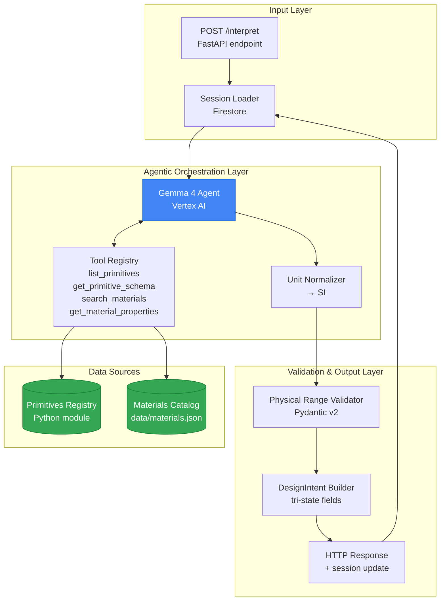
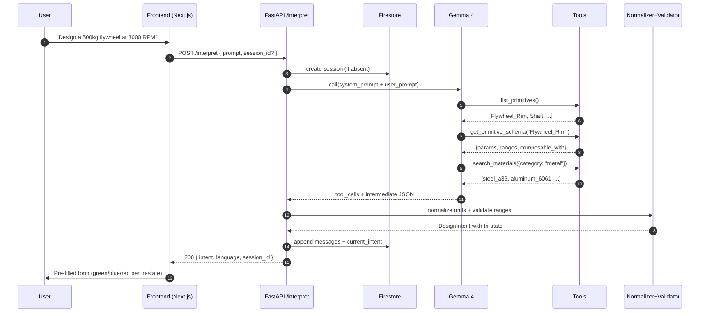
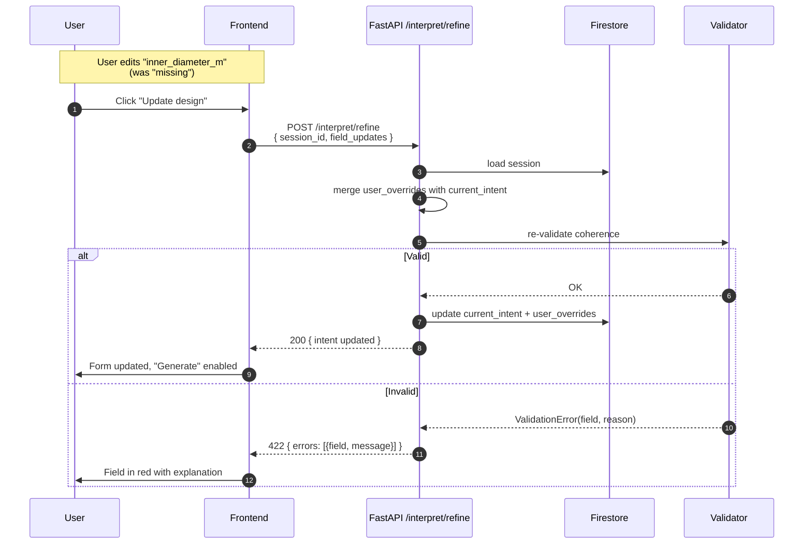

# S1 Interpreter — Design Spec

**Date**: 2026-04-18
**Subsystem**: S1 — Interpreter Service
**Parent document**: [DESIGN.md](../../../DESIGN.md)
**Status**: Approved, ready for implementation plan

---

## 1. Context and Purpose

The Interpreter is the first subsystem in the mechanical design pipeline. It converts a user's natural-language description of a mechanical component (in Spanish or English) into a structured `DesignIntent` that downstream subsystems (S2 Geometry, S3 Physics) can consume.

**Why this subsystem matters**: every other subsystem depends on its output. If the Interpreter fails or produces a bad intent, the entire pipeline breaks. It is also the user's FIRST point of contact with the system — its UX determines the product's accessibility for non-engineers.

---

## 2. Scope and Key Decisions

| Decision | Choice | Rationale |
|---|---|---|
| Input scope | **Medium** — free composition of primitives library (`Shaft`, `Plate`, `Flywheel_Rim`, etc.) | Demonstrates compositionality (technical depth scoring) without the "converge on anything" suicide of open scope |
| Conversation model | **Hybrid: extract → form** — LLM extracts what it can, frontend shows pre-filled form with `missing` fields highlighted | Best UX + video pacing; shows AI power AND user control |
| Primitive discovery | **Agentic function calling** — `list_primitives()` + `get_primitive_schema(name)` | Explicitly rewarded by hackathon scoring; scales beyond hardcoded prompts |
| Materials access | **Hybrid** — top-10 common materials in prompt + `search_materials()` / `get_material_properties()` tools for exotic lookups | Latency-optimal for common cases, agentic retrieval visible for exotic ones |
| Materials storage | **Local `data/materials.json`** (~50-100 curated entries) | Zero GCP setup; tool interface unchanged so BigQuery migration is trivial post-hackathon |
| Units | **Both imperial and metric, normalize to SI internally** | Global hackathon audience; internal SI prevents Mars Climate Orbiter-class bugs |
| Language | **Bilingual ES + EN** — user input in either language, Explainer responds in same | Digital Equity track; internal schemas remain English |
| Confidence signaling | **Tri-state per field** (`extracted` / `defaulted` / `missing` + `invalid` validation state) | LLM confidence scores are poorly calibrated; tri-state is deterministic and testable |
| Streaming | **SSE enabled** — `tool_call` events materialize agentic work in real time | Critical for video storytelling |
| Retries | **Max 1 retry per error type** | Bounds worst-case latency; user already waited |

---

## 3. Architecture

Three layers with clean separation. LLM output never touches the final schema directly — a deterministic builder transforms it.



### Layer responsibilities

**Input Layer** — receives the user prompt and loads session state (previous messages, user-confirmed field overrides) from Firestore. Supports multi-turn conversation where users can refine earlier extractions.

**Agentic Orchestration** — Gemma 4 receives prompt + session context + bilingual system prompt. It can call 4 tools and decides autonomously when. The Unit Normalizer is deterministic (not LLM) and runs after Gemma returns its JSON.

**Validation & Output** — Pydantic v2 validates physical ranges (positive density, diameters > 0, temperatures above absolute zero, cross-field consistency like `inner_diameter < outer_diameter`). The Builder assembles the final `DesignIntent` with tri-state per-field markers.

**Data Sources** — primitives are versioned Python code (schema exported via reflection); materials are a local JSON file loaded into memory at startup.

---

## 4. Components

### 4.1 Agentic Tools

Four tools with strict contracts, exposed to Gemma 4 via Vertex AI function calling.

```python
# Tool 1 — discovers what can be built
list_primitives() -> list[PrimitiveSummary]
# [{"name": "Shaft", "category": "rotational",
#   "description": "Cylindrical rotating element"}, ...]

# Tool 2 — investigates parameters of a specific primitive
get_primitive_schema(name: str) -> PrimitiveSchema
# {
#   "name": "Flywheel_Rim",
#   "params": {
#     "outer_diameter_m": {"type": "float", "min": 0.05, "max": 3.0, "required": true},
#     "inner_diameter_m": {"type": "float", "min": 0.0, "max": 2.8, "required": true},
#     ...
#   },
#   "composable_with": ["Shaft", "Bearing_Housing"]
# }

# Tool 3 — filters materials by criteria
search_materials(criteria: MaterialCriteria) -> list[MaterialRef]
# criteria: {"category": "metal"|"polymer"|..., "sustainable": bool,
#   "max_density_kg_m3": float, "min_yield_strength_mpa": float}

# Tool 4 — retrieves full material properties
get_material_properties(name: str) -> MaterialProperties
# density, young_modulus, yield_strength, uts, thermal_conductivity,
# relative_cost, sustainability_score
```

**Constraint**: the LLM cannot call any other function. Outputs referencing unknown tools are rejected and trigger a corrective retry.

### 4.2 System Prompt Structure

Versioned in `prompts/interpreter_system.md`, not in code. Four blocks:

1. **Role & Capabilities** — expert mechanical engineering assistant serving non-engineers
2. **Tools Protocol** — MUST call `list_primitives()` first before inventing names
3. **Output Contract** — tri-state per-field JSON format
4. **Language & Units** — respond in the language of the user input; parse any units and normalize to SI

### 4.3 Session Model (Firestore)

```typescript
// Collection: interpreter_sessions/{session_id}
{
  session_id: string,             // uuid
  user_id: string,                // "anonymous" allowed
  created_at: timestamp,
  updated_at: timestamp,
  language: "es" | "en",          // detected from first message
  messages: [
    { role: "user" | "assistant", content: string,
      tool_calls?: [...], timestamp }
  ],
  current_intent: DesignIntent,
  user_overrides: {               // fields user edited explicitly in the form
    [field_name]: { value, source: "user" }
  }
}
```

`user_overrides` always win over LLM re-inferences on `/refine`.

TTL policy: 24 hours of inactivity → auto-delete.

### 4.4 Unit Normalizer

Python component using `pint`. Gemma outputs raw strings in the `raw` field; normalizer converts to `{ value: float, unit_si: str, original: str }`. Original preserved for UI display.

### 4.5 Physical Range Validator

Pydantic v2 with per-field validators and a `@model_validator(mode='after')` for cross-field consistency.

```python
class DesignIntent(BaseModel):
    type: PrimitiveType
    fields: dict[str, TriStateField]

    @model_validator(mode='after')
    def validate_physical_consistency(self) -> Self:
        # Example: inner_diameter < outer_diameter for Flywheel_Rim
        # Example: material.max_temperature > operating_temp
        ...
```

Validation failures return `422` with the offending field(s) → frontend highlights them in the form.

---

## 5. Data Flow

### 5.1 Flow A — Initial Extraction (first user message)



Expected latency p95: 2–5s (Gemma 4 with 2–3 tool calls).

### 5.2 Flow B — Form Refinement (no LLM)



**Critical rule**: `/refine` never calls Gemma 4. It is deterministic (<100ms target). This makes the form responsive and eliminates a source of inconsistencies.

### 5.3 Flow C — SSE Streaming Contract (enabled)

`POST /interpret` returns `Content-Type: text/event-stream`. The frontend (Vercel AI SDK) consumes events in real time.

```
event: thinking
data: {"message": "Analyzing your design..."}

event: tool_call
data: {"tool": "list_primitives", "reason": "Discovering available primitives"}

event: tool_call
data: {"tool": "get_primitive_schema", "args": {"name": "Flywheel_Rim"}}

event: tool_call
data: {"tool": "search_materials", "args": {"category": "metal"}}

event: partial_intent
data: {"type": "flywheel", "fields": {...}}

event: final
data: {"session_id": "...", "intent": {...}, "language": "en"}

event: error
data: {"code": "invalid_json_retry_failed", "message": "..."}
```

`tool_call` events surface as user-visible chat messages ("🔍 Searching for suitable materials...") — materializes the agentic work in the demo video.

The stream always ends with exactly one `final` OR `error` event. Frontend applies a 15s timeout after the last event.

### 5.4 HTTP Contracts

```
POST /interpret
  Request:  { prompt: string, session_id?: string }
  Response: 200 text/event-stream (see 5.3)
            422 { errors: [{field, message}] }
            503 { error: "model_unavailable", retry_after: int }

POST /interpret/refine
  Request:  { session_id: string, field_updates: {[field]: value} }
  Response: 200 { intent: DesignIntent }
            404 { error: "session_not_found" }
            422 { errors: [{field, message}] }

GET /interpret/sessions/{session_id}
  Response: 200 { session, current_intent }
            404 { error: "session_not_found" }
```

---

## 6. Error Handling and Observability

### 6.1 Error Taxonomy

Stable `code` per error; `message` is user-facing and localized.

```python
class InterpreterError(BaseModel):
    code: Literal[
        "invalid_json_retry_failed",
        "unknown_primitive",
        "physical_range_violation",
        "ambiguous_intent",
        "unit_parse_failed",
        "vertex_ai_timeout",
        "vertex_ai_rate_limit",
        "session_not_found",
        "session_expired",
        "internal_error"
    ]
    message: str
    field: str | None = None
    details: dict | None = None
    retry_after: int | None = None
```

Raw LLM error strings are never returned to the user.

### 6.2 Retry Policy

| Error | Max retries | Strategy |
|---|---|---|
| `invalid_json` | 1 | corrective_prompt |
| `unknown_primitive` | 1 | corrective_prompt |
| `vertex_ai_timeout` | 0 | fail_fast |
| `vertex_ai_rate_limit` | 1 | exponential_backoff |
| `physical_range` | 0 | return_to_user (user corrects) |

A session with >5 retries is logged as an anomaly for audit.

### 6.3 Degraded Mode — "Cloud Mode Off"

Two consecutive Vertex AI failures → 60s degraded mode:

- New requests return 503 immediately, without calling Gemma 4
- Frontend shows banner: "AI assistant temporarily unavailable. You can continue in manual mode."
- **Manual mode**: frontend shows empty form with primitives listed — user fills manually. No LLM, but demo still works.

This is essential insurance for the live judging demo.

### 6.4 Observability

**Structured logs** (JSON only, never `print`):

```python
logger.info("interpret_request", extra={
    "session_id": session_id,
    "user_language": "es",
    "prompt_length": len(prompt),
    "latency_ms": elapsed,
    "tool_calls": ["list_primitives", "get_primitive_schema"],
    "gemma_tokens_input": 1234,
    "gemma_tokens_output": 567,
    "intent_type": "flywheel",
    "extracted_fields": 4,
    "defaulted_fields": 2,
    "missing_fields": 1,
})
```

**Cloud Trace spans**:
- `interpret.total`
  - `interpret.gemma_call` (attributes: model_version, token_count)
  - `interpret.tool.*` one span per tool invocation
  - `interpret.normalize_units`
  - `interpret.validate`

**Custom metrics** (Cloud Monitoring):
- `interpret.request_count{status, language, intent_type}`
- `interpret.latency_p50/p95/p99{intent_type}`
- `interpret.retry_count{error_code}`
- `interpret.gemma_tokens_total{direction: in|out}`
- `interpret.degraded_mode_active` (0|1 gauge)

### 6.5 PII and Security

- Never log full prompts in production — only length + language + hash
- Session TTL 24h via Firestore TTL policy
- Rate limit 30 req/min per IP (Cloud Armor or middleware)
- Gemma 4 output sanitized before being logged

---

## 7. Testing Strategy

### 7.1 Test Pyramid

| Layer | Type | Tests | Excludes |
|---|---|---|---|
| Unit | pytest, deterministic | Normalizer, Validator, Session merge, Error mapping | Real Gemma 4, real tools |
| Component | pytest + mocks | Agent loop orchestration, tool-call handling, retries | LLM quality |
| Integration | pytest + real Vertex | Prompt works with actual model, function calling responds | UI, Firestore |
| E2E | Playwright staging | Full frontend → persisted `DesignIntent` | Subjective intent quality |

### 7.2 Test Data Strategy — Golden Fixtures

```
tests/fixtures/gemma_responses/
├── flywheel_complete_es.json
├── flywheel_missing_inner_es.json
├── hydro_generator_en.json
├── shelter_complete_es.json
└── invalid_json_malformed.txt
```

Captured once from real Vertex calls, reused by component tests as mocks. Unit + component suites run in <3s without consuming Vertex quota.

Refresh policy: when the system prompt or the model version changes, regenerate with `pytest --regenerate-fixtures` (custom flag that calls Vertex real).

### 7.3 Critical Tests (minimum set)

- Normalizer: 10 unit tests across SI / imperial / mixed / invalid units
- Validator: 8 unit tests covering positive-value constraints and cross-field consistency
- Session merge: 6 unit tests (user overrides always win)
- Agent loop: 12 component tests (first call is `list_primitives`, retry policy, max-retry stop)
- Vertex integration: 5 tests marked `@pytest.mark.vertex` (run only in main CI)
- E2E: 3 Playwright tests (happy path flywheel, form refinement, degraded mode)

---

## 8. Acceptance Criteria

The S1 Interpreter subsystem is complete when:

**Functional**:
- [ ] Correctly extracts the 3 hero demos (flywheel, hydro generator, shelter) with >90% precision across 10 prompts per demo
- [ ] Handles Spanish and English inputs with equivalent precision (±5%)
- [ ] Normalizes SI, imperial, and mixed units correctly across 20 test cases
- [ ] Tri-state verified: at least one test per state (`extracted`, `defaulted`, `missing`, `invalid`)
- [ ] Manual mode works without Vertex AI (E2E test with mock down)

**Non-functional**:
- [ ] Latency p95 < 5s (streaming visible from t=500ms)
- [ ] Rate limit 30 req/min per IP enforced
- [ ] Cost per request < $0.01 in Vertex AI tokens (monitored)
- [ ] Session TTL of 24h applied in Firestore

**Quality**:
- [ ] Coverage >85% in `apps/backend/services/interpreter/`
- [ ] 0 `print()` in production code (only `logger`)
- [ ] 0 hardcoded prompt strings in Python code (all in `prompts/*.md`)
- [ ] CI runs unit + component in <30s, integration in <3min

**Documentation**:
- [ ] README in `services/interpreter/` with prompt examples
- [ ] Auto-generated OpenAPI spec published
- [ ] "Vertex down" runbook for live demo contingency

---

## 9. Demo Script (validates design against storytelling goal)

```
0:00-0:15 — User writes in Spanish:
  "Necesito un volante para almacenar 500 kJ a 3000 RPM"

0:15-0:25 — Visible stream in UI:
  🔍 Descubriendo primitivas disponibles...
  📐 Analizando opciones para volante de inercia...
  🧪 Buscando materiales adecuados (acero vs aluminio)...

0:25-0:35 — Pre-filled form appears:
  ✅ outer_diameter: 0.5m (extracted)
  🤖 inner_diameter: 0.1m (AI default)
  ⚠️ rpm: 3000 (extracted)
  ❌ thickness: required

0:35-0:45 — User fills "thickness: 50mm" → clicks Generate
  [continues into S2 → S5 pipeline]
```

If any part of the design cannot support this flow, the design is wrong.

---

## 10. Open Questions

None at the time of approval. All decisions (scope, conversation model, tool discovery, materials access, units, language, confidence signaling, streaming, retries, data sources) are confirmed.

---

## 11. Next Step

Invoke `writing-plans` skill to decompose this spec into an implementation plan.
