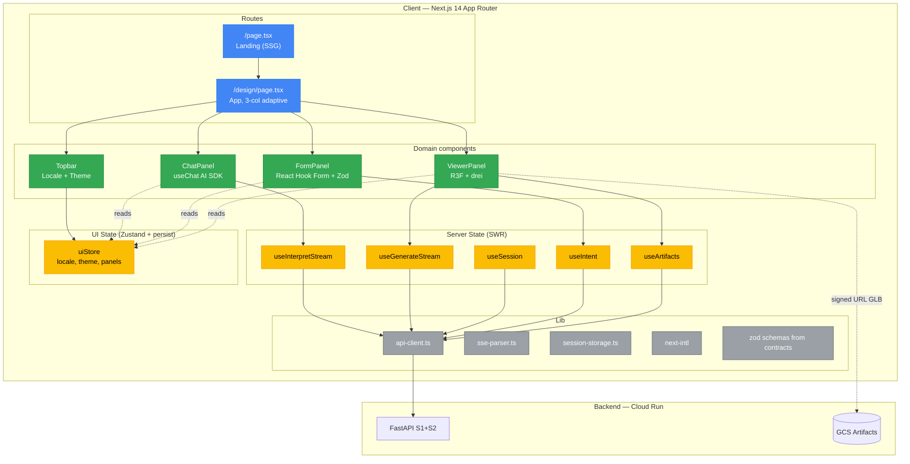
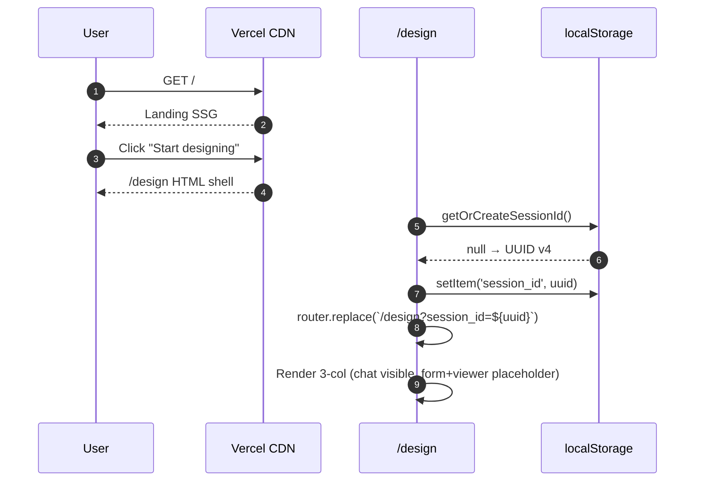
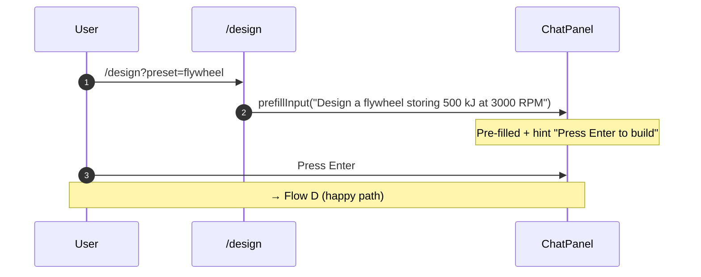
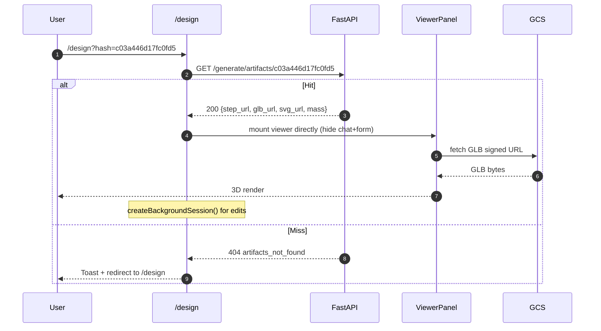
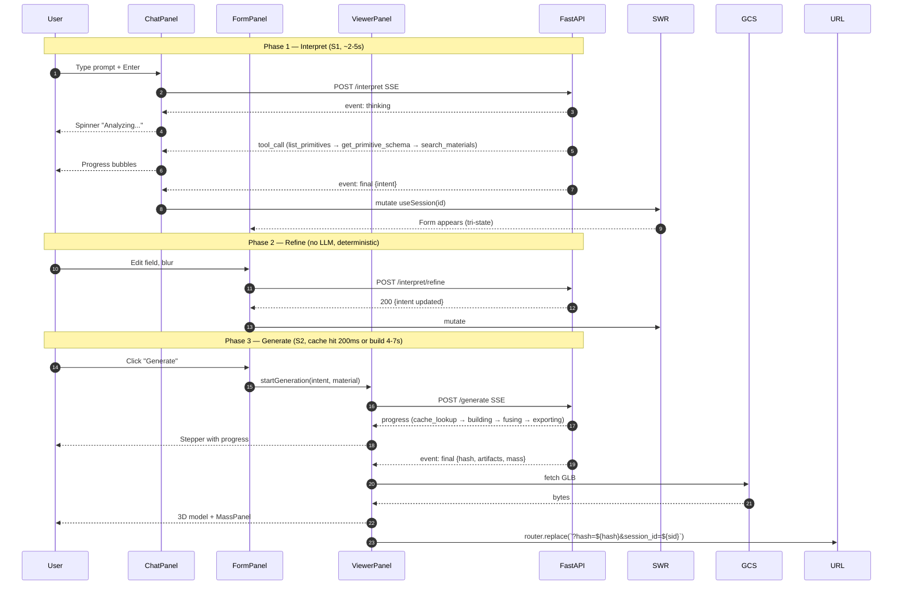
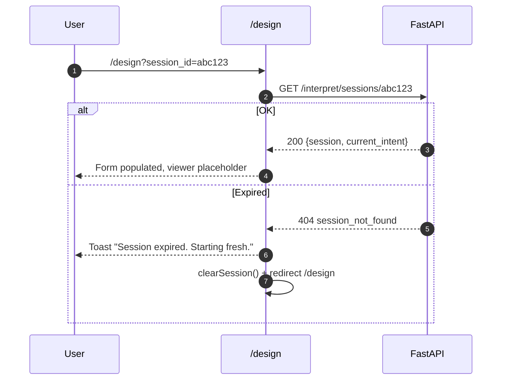

# Frontend — Design Spec

**Date**: 2026-04-19
**Subsystem**: Frontend (Next.js 14 on Vercel)
**Parent document**: [DESIGN.md](../../../DESIGN.md)
**Depends on**: [S1 Interpreter spec](2026-04-18-s1-interpreter-design.md), [S2 Geometry spec](2026-04-19-s2-geometry-design.md)
**Status**: Approved, ready for implementation plan

---

## 1. Context and Purpose

The Frontend is the user-facing layer of the AI-Driven Mechanical Design platform. It consumes the S1 (Interpreter) and S2 (Geometry) backend APIs to let a non-technical user describe a mechanical part in natural language and watch it come to life as a rotating 3D model with a downloadable CAD file.

**Why this subsystem matters**: the backend is invisible to the judges. The frontend IS the product. Its polish, pacing, and storytelling are 70% of the hackathon scoring (40 Impact/Vision + 30 Storytelling). A functional but ugly UI loses to a polished one — even if the backend is technically superior.

---

## 2. Scope and Key Decisions

| Decision | Choice | Rationale |
|---|---|---|
| Routes | **Landing (`/`) + design app (`/design`)** | Landing is the opening scene of the video; design app is the workhorse. No gallery/auth/settings for MVP |
| Query params | `?preset=<hero>`, `?hash=<intent_hash>`, `?session_id=<uuid>` | Preset prefills chat, hash jumps to viewer, session_id resumes |
| Layout | **3-column adaptive (30% chat / 20% form / 50% viewer)** on ≥lg; vertical stack + bottom-nav tabs below | All panels visible simultaneously in video — single-frame storytelling |
| State model | **SWR for server state + Zustand for UI-only state** (theme, locale, panel flags) | Eliminates cache/revalidation reinvention; keeps stores focused |
| Auth | **Anonymous** — `session_id` in localStorage + URL shareable | Backend already anonymous; URL shares enable "try this design" reproducibility |
| 3D viewer | **MVP+** — `OrbitControls`, `Environment preset="studio"` (PBR), grid helper, wireframe toggle, download buttons | Professional look without multi-day effort |
| i18n | **`next-intl` with toggle (no routing)** | Hackathon Digital Equity track requires ES+EN; toggle cheaper than routing setup |
| Stack | Next.js 14 App Router, TypeScript strict, Tailwind + shadcn/ui, Vercel AI SDK (chat), React Three Fiber + drei (3D), React Hook Form + Zod (forms), Zustand + persist (UI store), SWR (server state) | Standard modern Next.js stack; matches `DESIGN.md` §5 |
| Deployment | **Vercel** (auto-deploy on push to main; PR previews) | Edge CDN, zero-config, hackathon-friendly |

---

## 3. Architecture

Client-side Next.js 14 App Router. SSR only for the landing page (SSG). Design app is client-only (`'use client'` at the route root). Server state via SWR; UI state via Zustand.



### Layer responsibilities

**Pages** — two routes only:
- `/` — SSG landing. Hero headline + 3 CTA cards linking to `/design?preset={flywheel|hydro|shelter}`.
- `/design` — `'use client'`. 3-column layout. Hosts the chat/form/viewer trio.

**Domain components** — one concern each:
- `ChatPanel` — consumes `POST /interpret` SSE via custom `useInterpretStream`; `useChat` from Vercel AI SDK provides the input UI and history.
- `FormPanel` — reads intent via `useIntent()` (SWR-derived); edits dispatch `POST /interpret/refine`.
- `ViewerPanel` — reads artifacts via `useArtifacts()`; the `useGenerateStream` hook drives `POST /generate` SSE.
- `Topbar` — locale toggle + theme toggle; only touches `uiStore`.

**Server state (SWR)** — cache + revalidation for all backend-owned data. Custom streaming hooks wrap SSE endpoints (SWR is request/response-oriented, but we can layer `useSyncExternalStore` on top).

**UI state (Zustand + `persist`)** — only client-owned concerns: selected locale, theme, which side panels are expanded.

**Lib** — stateless utilities: fetch wrapper, SSE parser, session UUID helpers, next-intl config, zod schemas generated from `packages/contracts/`.

### Key architectural decisions

**SSE does NOT pass through Next.js API routes.** The browser connects directly to the Cloud Run backend. Reason: Vercel API route timeouts (60s Pro / 10s Hobby) bottleneck 15s streams. CORS is configured backend-side for `*.vercel.app`.

**No SSR for domain data.** The `/design` route is 100% client-side. Streaming + SSE + RSC in Next.js 14 has too many rough edges for hackathon stability. Landing is SSG (or ISR for hero thumbnails).

---

## 4. Components

### 4.1 Repo structure

```
apps/frontend/
├── app/
│   ├── layout.tsx                    # Root, NextIntlClientProvider, theme
│   ├── page.tsx                      # Landing (SSG)
│   ├── design/
│   │   ├── page.tsx                  # 'use client', 3-col layout
│   │   └── error.tsx                 # error boundary
├── components/
│   ├── chat/
│   │   ├── ChatPanel.tsx
│   │   ├── ChatMessage.tsx
│   │   ├── ChatInput.tsx
│   │   └── StreamingIndicator.tsx
│   ├── form/
│   │   ├── FormPanel.tsx
│   │   ├── FieldRow.tsx
│   │   ├── MaterialSelector.tsx
│   │   └── GenerateButton.tsx
│   ├── viewer/
│   │   ├── ViewerPanel.tsx
│   │   ├── ModelMesh.tsx
│   │   ├── ViewerControls.tsx
│   │   └── MassPanel.tsx
│   ├── shared/
│   │   ├── Topbar.tsx
│   │   ├── ProgressStream.tsx
│   │   └── ErrorBanner.tsx
│   └── ui/                           # shadcn/ui copy-pasted
├── lib/
│   ├── api-client.ts
│   ├── sse-parser.ts
│   ├── session-storage.ts
│   ├── errors.ts                     # ERROR_MAP
│   ├── hooks/
│   │   ├── useSession.ts
│   │   ├── useIntent.ts
│   │   ├── useArtifacts.ts
│   │   ├── useInterpretStream.ts
│   │   └── useGenerateStream.ts
│   ├── stores/
│   │   └── uiStore.ts                # Zustand + persist
│   └── intl/
│       └── config.ts
├── messages/
│   ├── es.json
│   └── en.json
├── public/
│   ├── hero-flywheel-thumb.png
│   ├── hero-hydro-thumb.png
│   ├── hero-shelter-thumb.png
│   └── mock.glb                      # tests fixture
├── test/
│   └── msw/
│       ├── handlers.ts
│       └── server.ts
├── middleware.ts                     # next-intl
├── next.config.mjs
├── tailwind.config.ts
├── tsconfig.json
├── vitest.config.ts
├── playwright.config.ts
├── package.json
└── vercel.json
```

### 4.2 ChatPanel

```tsx
'use client'
import { useChat } from 'ai/react'
import { useSessionId } from '@/lib/session-storage'
import { parseSSEResponse } from '@/lib/sse-parser'
import { ChatMessage } from './ChatMessage'
import { StreamingIndicator } from './StreamingIndicator'

export function ChatPanel() {
  const sessionId = useSessionId()
  const { messages, input, handleSubmit, isLoading, data } = useChat({
    api: `${process.env.NEXT_PUBLIC_API_URL}/interpret`,
    body: { session_id: sessionId },
    streamProtocol: 'text',
    onResponse: parseSSEResponse,
  })
  return (
    <aside className="flex flex-col h-full border-r">
      <div className="flex-1 overflow-y-auto p-4 space-y-3">
        {messages.map((m) => <ChatMessage key={m.id} message={m} />)}
        {isLoading && <StreamingIndicator events={data?.events ?? []} />}
      </div>
      <ChatInput value={input} onChange={handleSubmit} disabled={isLoading} />
    </aside>
  )
}
```

### 4.3 FormPanel (tri-state visual rendering)

Four visual states per field:

| `source` | Border | Badge | Editable |
|---|---|---|---|
| `extracted` | green | "From your input" | yes |
| `defaulted` | blue | "AI default: {reason}" | yes |
| `missing` | red | "Required" | yes (must fill) |
| `invalid` | yellow | error message | yes |
| `user` | purple | "Your override" | yes |

```tsx
'use client'
import { useForm } from 'react-hook-form'
import { zodResolver } from '@hookform/resolvers/zod'
import { useIntent } from '@/lib/hooks/useIntent'
import { intentToFormSchema } from '@/lib/schemas/form'
import { FieldRow } from './FieldRow'
import { GenerateButton } from './GenerateButton'

export function FormPanel() {
  const { intent, refineIntent } = useIntent()
  const form = useForm({
    resolver: zodResolver(intentToFormSchema(intent)),
    defaultValues: intent?.fields,
  })
  if (!intent) return <FormPlaceholder />

  return (
    <section className="flex flex-col h-full border-r p-4">
      <h2 className="text-lg font-semibold">{t('form.title')}</h2>
      <form onSubmit={form.handleSubmit(refineIntent)} className="flex-1 space-y-3 overflow-y-auto">
        {Object.entries(intent.fields).map(([name, field]) => (
          <FieldRow key={name} name={name} field={field} control={form.control} />
        ))}
      </form>
      <GenerateButton disabled={intent.hasMissingFields} onGenerate={triggerGenerate} />
    </section>
  )
}
```

Refine strategy: `onBlur` per field triggers `POST /interpret/refine`. Form is NOT optimistic — it waits for the server's validated intent before updating local state. When the server returns a new intent, `form.reset(newValues)` runs to avoid dirty-state drift.

### 4.4 ViewerPanel

```tsx
'use client'
import { Canvas } from '@react-three/fiber'
import { OrbitControls, Environment, useGLTF, useProgress, Html, Grid } from '@react-three/drei'
import { Suspense, useEffect } from 'react'
import { useArtifacts } from '@/lib/hooks/useArtifacts'
import { useUIStore } from '@/lib/stores/uiStore'
import { ViewerControls } from './ViewerControls'
import { MassPanel } from './MassPanel'

export function ViewerPanel() {
  const { artifacts, massProperties, isGenerating, progress } = useArtifacts()
  if (isGenerating) return <GenerationProgress events={progress} />
  if (!artifacts) return <ViewerPlaceholder />

  return (
    <section className="flex flex-col h-full relative">
      <Canvas shadows camera={{ position: [2, 1.5, 2], fov: 45 }}>
        <Suspense fallback={<LoadingFallback />}>
          <Environment preset="studio" />
          <ambientLight intensity={0.3} />
          <directionalLight position={[5, 5, 5]} castShadow />
          <Grid infiniteGrid cellSize={0.1} sectionSize={1} />
          <ModelMesh glbUrl={artifacts.glb_url} />
          <OrbitControls makeDefault enableDamping />
        </Suspense>
      </Canvas>
      <ViewerControls />
      <MassPanel properties={massProperties} />
    </section>
  )
}

function ModelMesh({ glbUrl }: { glbUrl: string }) {
  const { scene } = useGLTF(glbUrl)
  const wireframe = useUIStore((s) => s.viewerWireframe)
  useEffect(() => {
    scene.traverse((obj: any) => {
      if (obj.isMesh) obj.material.wireframe = wireframe
    })
  }, [wireframe, scene])
  return <primitive object={scene} castShadow receiveShadow />
}

function LoadingFallback() {
  const { progress } = useProgress()
  return <Html center><div className="bg-black/60 text-white px-3 py-1 rounded">Loading 3D... {progress.toFixed(0)}%</div></Html>
}
```

### 4.5 API client + SSE parser

```typescript
// lib/api-client.ts
const API_BASE = process.env.NEXT_PUBLIC_API_URL!

export async function apiGet<T>(path: string): Promise<T> {
  const res = await fetch(`${API_BASE}${path}`, { credentials: 'omit' })
  if (!res.ok) throw new ApiError(res.status, await res.json())
  return res.json()
}

export async function apiPost<T>(path: string, body: unknown): Promise<T> {
  const res = await fetch(`${API_BASE}${path}`, {
    method: 'POST',
    headers: { 'Content-Type': 'application/json' },
    body: JSON.stringify(body),
  })
  if (!res.ok) throw new ApiError(res.status, await res.json())
  return res.json()
}

export async function* apiStream(path: string, body: unknown): AsyncGenerator<SSEEvent> {
  const res = await fetch(`${API_BASE}${path}`, {
    method: 'POST',
    headers: { 'Content-Type': 'application/json' },
    body: JSON.stringify(body),
  })
  if (!res.ok) throw new ApiError(res.status, await res.json())
  const reader = res.body!.pipeThrough(new TextDecoderStream()).getReader()
  yield* parseSSE(reader)
}

// lib/sse-parser.ts
export async function* parseSSE(reader: ReadableStreamDefaultReader<string>) {
  let buffer = ''
  while (true) {
    const { done, value } = await reader.read()
    if (done) return
    buffer += value
    const events = buffer.split('\n\n')
    buffer = events.pop() ?? ''
    for (const raw of events) {
      const match = raw.match(/^event: (\w+)\ndata: (.*)$/ms)
      if (match) yield { event: match[1], data: JSON.parse(match[2]) }
    }
  }
}
```

### 4.6 Zod schemas from contracts

```bash
# scripts/generate-types.sh
json-schema-to-typescript packages/contracts/*.schema.json -o apps/frontend/lib/types.gen.ts
json-schema-to-zod packages/contracts/*.schema.json -o apps/frontend/lib/schemas.gen.ts
```

Run in `postinstall` to keep types synced with Pydantic backend. Zero drift.

### 4.7 i18n (next-intl)

```typescript
// i18n.ts
import { getRequestConfig } from 'next-intl/server'
import { notFound } from 'next/navigation'

export default getRequestConfig(async ({ locale }) => {
  if (!['es', 'en'].includes(locale as string)) notFound()
  return { messages: (await import(`./messages/${locale}.json`)).default }
})

// middleware.ts
import createMiddleware from 'next-intl/middleware'
export default createMiddleware({
  locales: ['es', 'en'],
  defaultLocale: 'en',
  localePrefix: 'never',
})
```

User toggles locale via `useUIStore.setLocale()`. Root layout reads from the store and wraps children in `<NextIntlClientProvider locale={locale} messages={messages}>`.

**What is NOT translated**: schema field names (`type`, `field_name`, `source`), unit symbols (`m`, `kg`, `rpm`), primitive names (`Flywheel_Rim`), material IDs (`steel_a36`). Only human-facing prose.

**Auto-detection**: first visit uses `navigator.language.startsWith('es') ? 'es' : 'en'`. Persists to localStorage; UI toggle overrides.

### 4.8 UI Store (Zustand + persist)

```typescript
import { create } from 'zustand'
import { persist } from 'zustand/middleware'

type UIStore = {
  locale: 'es' | 'en'
  theme: 'light' | 'dark'
  viewerWireframe: boolean
  viewerBackgroundDark: boolean
  formPanelExpanded: boolean
  setLocale: (l: 'es' | 'en') => void
  toggleTheme: () => void
  setViewerWireframe: (v: boolean) => void
  setViewerBackgroundDark: (v: boolean) => void
  setFormPanelExpanded: (v: boolean) => void
}

export const useUIStore = create<UIStore>()(
  persist(
    (set) => ({
      locale: 'en',
      theme: 'light',
      viewerWireframe: false,
      viewerBackgroundDark: true,
      formPanelExpanded: true,
      setLocale: (l) => set({ locale: l }),
      toggleTheme: () => set((s) => ({ theme: s.theme === 'light' ? 'dark' : 'light' })),
      setViewerWireframe: (v) => set({ viewerWireframe: v }),
      setViewerBackgroundDark: (v) => set({ viewerBackgroundDark: v }),
      setFormPanelExpanded: (v) => set({ formPanelExpanded: v }),
    }),
    { name: 'mechdesign-ui' }
  )
)
```

---

## 5. Data Flow

### 5.1 Flow A — First visitor (landing → design)



### 5.2 Flow B — Hero preset (`?preset=flywheel`)



Preset is a hint, NOT auto-submit — the conscious pause is what the video captures.

### 5.3 Flow C — Hash share (`?hash=c03a446d...`)



### 5.4 Flow D — Happy path (chat → form → generate → viewer)



### 5.5 Flow E — Session resume (`?session_id=xxx`)



### 5.6 HTTP contracts

| Frontend action | Backend endpoint | Response |
|---|---|---|
| ChatPanel submit | `POST /interpret` | `text/event-stream` |
| FormPanel edit | `POST /interpret/refine` | `200 JSON` or `422` |
| ViewerPanel generate | `POST /generate` | `text/event-stream` |
| Hash share | `GET /generate/artifacts/{hash}` | `200` or `404` |
| Session resume | `GET /interpret/sessions/{id}` | `200` or `404` |
| Demo fallback (via signed URL) | `GET /generate/demo_artifact/{hash}/{file}` | binary or `404` |

### 5.7 URL state machine

```
/design                             → new session, UUID auto-generated
/design?session_id=uuid             → resume existing session
/design?preset=flywheel             → prefill chat + new session
/design?hash=c03a446d               → direct viewer, shareable
/design?hash=c03a446d&session_id=uuid → viewer + active session
```

URL updates via `router.replace()` (no `push()`) — no history pollution. Back button returns to landing.

### 5.8 Form reset discipline

Every `useIntent()` emission calls `form.reset(newValues)`. Consequence: **the server is the source of truth, not form local state**. Trade-off: in-flight edits get overwritten if a server event arrives mid-type. For hackathon this is acceptable; production adds debounce + conflict resolution.

---

## 6. Error Handling + Loading + i18n + A11y

### 6.1 Error code → UI mapping

```typescript
export const ERROR_MAP: Record<string, ErrorDisplay> = {
  // S1
  invalid_json_retry_failed: { severity: 'error', i18nKey: 'errors.interpret.invalid_json', action: 'retry' },
  unknown_primitive: { severity: 'error', i18nKey: 'errors.interpret.unknown_primitive', action: 'retry' },
  physical_range_violation: { severity: 'warning', i18nKey: 'errors.validation.out_of_range', action: 'fix_field' },
  vertex_ai_timeout: { severity: 'error', i18nKey: 'errors.infra.timeout', action: 'retry_later' },
  vertex_ai_rate_limit: { severity: 'warning', i18nKey: 'errors.infra.rate_limit', action: 'retry_after' },
  session_not_found: { severity: 'info', i18nKey: 'errors.session.expired', action: 'new_session' },
  // S2
  parameter_out_of_range: { severity: 'warning', i18nKey: 'errors.geometry.param_range', action: 'fix_field' },
  composition_rule_missing: { severity: 'error', i18nKey: 'errors.geometry.composition_missing', action: 'report_bug' },
  build123d_failed: { severity: 'error', i18nKey: 'errors.geometry.build_failed', action: 'simplify_params' },
  boolean_operation_failed: { severity: 'error', i18nKey: 'errors.geometry.boolean_failed', action: 'simplify_params' },
  material_not_found: { severity: 'error', i18nKey: 'errors.geometry.unknown_material', action: 'select_valid' },
  gcs_unavailable: { severity: 'warning', i18nKey: 'errors.geometry.gcs_down', action: 'retry_after' },
  gcs_upload_failed: { severity: 'error', i18nKey: 'errors.geometry.upload_failed', action: 'retry_later' },
  internal_error: { severity: 'error', i18nKey: 'errors.generic', action: 'contact_support' },
}
```

### 6.2 UI patterns per severity

- `error` → persistent red banner in affected panel + action button
- `warning` → toast ~5s + red highlight on offending field when `error.field` is set
- `info` → blue toast ~3s + optional action

### 6.3 SSE stream error handling

Three failure modes:
- **Mid-stream `error` event** — backend emits `event: error`; hook captures + terminates cleanly
- **Connection drop** — `for await` throws; treat as synthetic `connection_lost` code
- **Timeout (>15s with no event)** — internal timer cancels + shows "Taking too long. Retry?"

```typescript
export function useInterpretStream() {
  const [state, setState] = useState<StreamState>('idle')
  const [error, setError] = useState<BackendError | null>(null)
  async function start(prompt: string) {
    setState('streaming'); setError(null)
    try {
      for await (const event of apiStream('/interpret', { prompt, session_id })) {
        if (event.event === 'error') { setError(event.data); setState('error'); return }
        handleEvent(event)
      }
      setState('done')
    } catch {
      setError({ code: 'connection_lost', message: 'Connection interrupted' })
      setState('error')
    }
  }
  return { state, error, start }
}
```

### 6.4 Loading states

**Chat**: input disabled during streaming; progress bubbles visible; abort button active.
**Form**: before first intent → `<FormPlaceholder>`; during refine → opacity 50% overlay + spinner on modified field.
**Viewer**: before artifacts → `<ViewerPlaceholder>`; during generate → horizontal stepper; during GLB load → drei `useProgress()` overlay.
**Landing**: SSG, zero loading states.

### 6.5 Accessibility baseline

- ARIA landmarks: `<header>`, `<nav>`, `<main>`, `<aside aria-label="Chat">`, `<section aria-label="3D viewer">`
- Focus management: on generate `final`, focus moves to MassPanel
- Keyboard: Tab cycle (chat → form → generate → viewer controls); `Ctrl+Enter` = send; `Esc` = close modals
- Screen reader: `<div aria-live="polite">` announces SSE progress
- Color contrast: shadcn/ui WCAG AA by default
- 3D viewer `<figcaption>` describes the model in text for SR users
- `prefers-reduced-motion` disables OrbitControls damping

### 6.6 Degraded mode UI

When `gcs_unavailable`:
```tsx
return (
  <div className="viewer-degraded">
    <p className="text-yellow-600">{t('errors.geometry.gcs_down')}</p>
    <p className="text-sm opacity-70">You can still enter parameters. The 3D viewer will return.</p>
    <RetryButton onRetry={regenerate} />
  </div>
)
```

Hero demos silently use the proxy endpoint (`/generate/demo_artifact/...`) via the backend's fallback — fully transparent to the frontend.

### 6.7 Error boundary

`app/design/error.tsx` catches unhandled render errors + provides Reload button. Sentry integration opcional post-hackathon.

---

## 7. Testing Strategy

### 7.1 Test pyramid

| Layer | Tool | Scope |
|---|---|---|
| Unit | Vitest + jsdom | Pure utils (sse-parser, error mapper, intent→form schema) |
| Component | Vitest + React Testing Library | Components in isolation + props + mocks |
| Integration | Vitest + MSW | Full flows against mocked backend |
| E2E | Playwright | Real browser against staging |

Tool choice: **Vitest** over Jest (faster, first-class Vite/Next.js integration).

### 7.2 Mock backend — MSW

MSW intercepts `fetch` at the Service Worker layer. Handlers in `test/msw/handlers.ts` mirror the S1+S2 contracts. Uses the same Zod schemas that the runtime uses, preventing mock drift.

### 7.3 Minimum test set

- Unit: ~12 (sse-parser 3, error map 2, session-storage 3, intent schema 4)
- Component: ~20 (FieldRow tri-state, ChatPanel streaming, ViewerControls, MassPanel, Topbar locale toggle, ...)
- Integration: ~6 (happy path, refine loop, hash-share, session-expired, GCS-down degraded, preset)
- E2E: ~3 (full hero demo, locale toggle, download STEP)

### 7.4 Public fixtures

`/public/mock.glb` — a pre-generated GLB of a cube. Lets the viewer render something concrete in tests without real Cloud Run.

---

## 8. Acceptance Criteria

**Functional**:
- [ ] Landing renders 3 hero cards → correct preset URLs
- [ ] `?preset=flywheel` prefills chat with canonical ES/EN prompt
- [ ] `?hash=<valid>` skips chat + form, loads viewer
- [ ] `?session_id=<expired>` redirects to fresh session with toast
- [ ] Chat stream shows progress bubbles for each `tool_call`
- [ ] Form shows 4 visual states (extracted/defaulted/missing/user)
- [ ] Missing field disables Generate button
- [ ] Refine dispatches on blur
- [ ] Generate stream progress visible in viewer
- [ ] GLB loads, rotate + zoom work, wireframe toggle works
- [ ] Download STEP + GLB buttons trigger signed URL fetches
- [ ] Locale toggle switches every string ES ↔ EN
- [ ] Degraded mode banner appears for `gcs_unavailable`

**Non-functional**:
- [ ] Lighthouse Performance ≥85, A11y ≥95, Best Practices ≥90
- [ ] Landing FCP < 2s (Vercel edge)
- [ ] Viewer TTI < 3s after `final`
- [ ] First-load JS ≤ 300 KB gzipped
- [ ] Chrome/Firefox/Safari/Edge latest
- [ ] Mobile-friendly at 375px width

**Quality**:
- [ ] Coverage ≥80% in `lib/`
- [ ] 0 `any` types (explicit `unknown` where uncertain)
- [ ] ESLint + Prettier clean
- [ ] 0 `console.*` in production (ESLint `no-console`)
- [ ] All strings in `messages/*.json`
- [ ] All API responses typed via contracts

**Documentation**:
- [ ] `apps/frontend/README.md` with local dev + deploy
- [ ] Optional Storybook for chat/form/viewer if time permits

---

## 9. Demo Script (3-minute video)

```
0:00-0:15 — Landing (ES browser)
  "Diseñá piezas mecánicas en lenguaje natural"
  Three hero cards visible
  User clicks "Refugio de emergencia"
  URL: /design?preset=shelter

0:15-0:30 — Chat phase
  Pre-filled prompt: "Un refugio plegable para 4 personas..."
  User presses Enter
  Bubbles:
    🔍 Descubriendo primitivas disponibles
    📐 Analizando Hinge_Panel
    🧪 Buscando materiales sostenibles
  Form panel appears with tri-state fields

0:30-0:50 — Form phase
  "thickness_m" highlighted red (missing)
  User types "20 mm"
  Locale toggle: ES → EN, all labels switch to English
  Material dropdown: user selects "bamboo_laminated"
  User clicks "Generate"

0:50-1:20 — Generate phase
  Viewer stepper:
    📐 Building Hinge_Panel...
    🔗 Adding Tensor_Rod...
    🔗 Adding Base_Connector...
    ⚙️ Fusing assembly...
    📦 Exporting STEP... GLB... SVG...
    📊 Computing mass: 34 kg

1:20-2:00 — 3D viewer
  GLB loads, user rotates the shelter
  Wireframe toggle on/off
  MassPanel: 34 kg, 0.03 m³, bbox 1×2×0.02 m
  User clicks "Download STEP" — real CAD file downloads

2:00-2:30 — Share flow
  User copies URL (contains ?hash=...)
  Opens in incognito browser
  Viewer loads instantly from GCS cache
  "Instant reproducibility"

2:30-3:00 — Close
  Voice-over: "An AI mechanical engineer — accessible to anyone"
  Architecture diagram visible for 3s
  Credits + CTA
```

If any transition above cannot be supported by the design, the design is wrong.

---

## 10. Pre-submission Checklist (May 18)

- [ ] Lighthouse on production Vercel URL
- [ ] Smoke E2E on Chrome + Firefox + Safari
- [ ] 3 hero demos load viewer (preset + hash paths)
- [ ] DevTools throttle (slow 3G) — UX still graceful
- [ ] Backend down → degraded mode + demo fallback works
- [ ] i18n: every string has ES + EN translation
- [ ] Mobile check iPhone Safari + Android Chrome
- [ ] Share URL with `?hash=<valid>` from another device

---

## 11. Open Questions

None at approval time. All decisions confirmed:
- Routes: Landing + `/design` + query params
- Layout: 3-col adaptive
- State: SWR (server) + Zustand (UI)
- Auth: anonymous, localStorage + URL shareable
- Viewer: MVP+ (PBR + grid + controls)
- i18n: next-intl + toggle
- Test: Vitest + MSW + Playwright

---

## 12. Next Step

Invoke `superpowers:writing-plans` to decompose this spec into an implementation plan.
