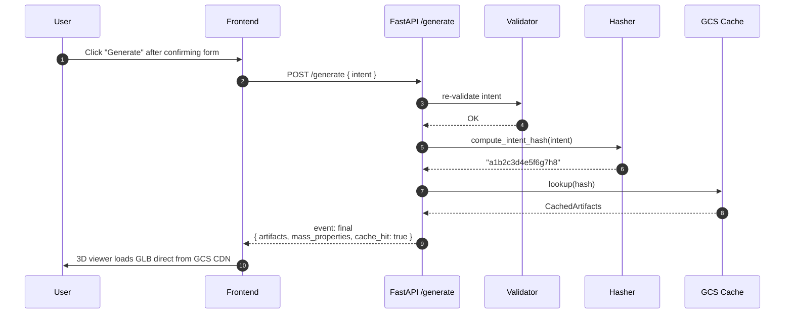
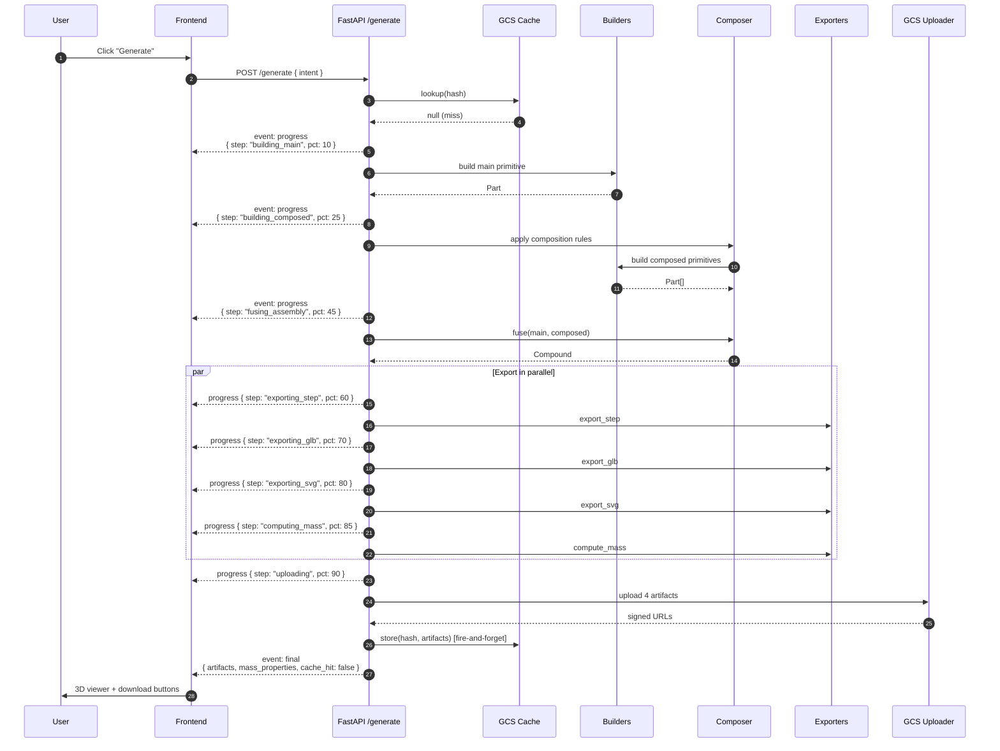

# S2 Geometry — Design Spec

**Date**: 2026-04-19
**Subsystem**: S2 — Geometry Service
**Parent document**: [DESIGN.md](../../../DESIGN.md)
**Depends on**: [S1 Interpreter spec](2026-04-18-s1-interpreter-design.md)
**Status**: Approved, ready for implementation plan

---

## 1. Context and Purpose

The Geometry service converts a validated `DesignIntent` (output of S1) into professional CAD artifacts: STEP (universal CAD download), GLB (web 3D viewer), SVG (2D section for PDF reports), and mass properties (mass, center of gravity, bounding box, volume). It is the **second subsystem** in the mechanical design pipeline.

**Why this subsystem matters**: S2 is what makes the output **tangible**. S1 produces a spec; S2 produces something the user can see, rotate, download, and open in SolidWorks. It is also the unblock for S3 (physics needs geometry), S4 (explainer needs mass properties), and S5 (documenter needs all artifacts).

---

## 2. Scope and Key Decisions

| Decision | Choice | Rationale |
|---|---|---|
| API shape | **Separate `POST /generate` endpoint** | Preserves S1's hybrid extract-→-form UX; user explicitly triggers geometry generation; testable independently |
| Latency model | **Sync with SSE streaming** of progress events | Consistent with S1's streaming infra; materializes the work for the demo video; no async queue overhead |
| Composition model | **Hardcoded rules in dict registry** `(main, composed) -> rule_fn` | Sufficient for 7 primitives × 3 hero demos; mirrors the `_CROSS_FIELD_RULES` pattern from S1 validators; no schema extension to S1 |
| Primitive code layout | **One file per primitive, pure functions** under `services/geometry/primitives/` | <100 LOC per file; easier to test; consistent with Clean Architecture |
| Service location in repo | **`apps/backend/services/geometry/`** (sibling to `services/interpreter/`) | Each subsystem owns its boundaries; clean deploy target |
| Artifact storage | **Hybrid: metadata inline, binaries on GCS with signed URLs** | Small JSON returns instantly; binaries stream from CDN; "download STEP" button is a direct GCS hit |
| Mandatory artifacts | **STEP + GLB + SVG + mass properties** | Cover CAD download, web viewer, PDF report, downstream S3/S4 |
| Caching | **GCS cache keyed by hash of intent values**, global scope, 16-char hex | Hero demos run many times in development and during the video; second-hit latency <300ms vs 4-7s rebuild |
| Error strategy | **Structured error codes, no fallback rebuild** | Failures are deterministic in build123d — retry won't help. User adjusts params and retries |
| Build retries | **0** for build failures, **1 with backoff** for GCS/infra failures | build123d errors are user-actionable; GCS hiccups are transient |
| Degraded mode | **Breaker on GCS + pre-generated demo artifacts on disk fallback** | Live demo survives GCS outage |
| Rate limit | **10 req/min per IP** | Lower than S1's 30/min — each call is heavier |

---

## 3. Architecture

Four layers + a transversal caching layer.

```mermaid
graph TB
    subgraph Input["Input Layer"]
        HTTP[POST /generate<br/>FastAPI SSE]
        INPUT_VAL[DesignIntent Validator<br/>re-check]
    end

    subgraph Cache["Cache Layer (transversal)"]
        HASH[Intent Hasher<br/>sha256 16-char]
        GCS_CACHE[(GCS Cache<br/>cache/{hash}/*)]
    end

    subgraph Build["Build Layer"]
        BUILDERS[Primitives Builders<br/>Flywheel_Rim, Shaft,<br/>Pelton_Runner, Hinge_Panel,<br/>+3 more]
        COMPOSER[Composer<br/>applies rules + boolean ops]
        COMP_RULES[(Composition Rules<br/>dict registry)]
    end

    subgraph Export["Export Layer"]
        STEP[STEP Exporter<br/>AP214]
        GLB[GLB Exporter<br/>export_gltf tessellation=1mm]
        SVG[SVG Exporter<br/>section views]
        MASS[Mass Props Calculator<br/>mass + CoG + inertia + bbox]
    end

    subgraph Storage["Storage Layer"]
        UPLOADER[GCS Uploader<br/>signed URLs 24h]
        GCS_ART[(GCS Artifacts)]
    end

    HTTP --> INPUT_VAL
    INPUT_VAL --> HASH
    HASH --> GCS_CACHE
    GCS_CACHE -.cache hit.-> HTTP
    GCS_CACHE -.cache miss.-> BUILDERS
    BUILDERS --> COMPOSER
    COMPOSER --> COMP_RULES
    COMPOSER --> STEP
    COMPOSER --> GLB
    COMPOSER --> SVG
    COMPOSER --> MASS
    STEP --> UPLOADER
    GLB --> UPLOADER
    SVG --> UPLOADER
    MASS -.inline.-> HTTP
    UPLOADER --> GCS_ART
    GCS_ART -.signed URLs.-> HTTP

    classDef cad fill:#4285F4,stroke:#1a73e8,color:#fff
    classDef storage fill:#34A853,stroke:#188038,color:#fff
    class BUILDERS,COMPOSER,STEP,GLB,SVG cad
    class GCS_CACHE,GCS_ART storage
```

### Layer responsibilities

**Input Layer** — FastAPI endpoint accepting `{ intent: DesignIntent, session_id?: string }`. Re-runs the validators from S1 (`validate_physical_consistency`) as defense in depth — the client could have tampered with the intent.

**Cache Layer** (transversal) — before any build, hashes the intent (values only, not tri-state metadata). On hit, returns signed URLs + cached mass properties. On miss, falls through to Build.

**Build Layer** — pure-function builders per primitive produce `build123d.Part`. The Composer applies composition rules from the registry, resolves composed primitives' params, and fuses all parts into a single `Compound`.

**Export Layer** — four parallel exports: STEP (`export_step`), GLB (`export_gltf` with tessellation=1mm), SVG (front section via `section_xz` + `export_svg`), mass properties (volume × density + center_of_mass + bounding_box).

**Storage Layer** — uploads binaries to `gs://mechdesign-artifacts/cache/{hash}/{type}.{ext}` and returns signed URLs (24h TTL, matching session TTL).

### Key design principle

**Determinism flows through every layer.** Same `DesignIntent` values → same hash → same cached artifacts → same signed URLs' underlying bytes. This is critical for:
- Reliable cache hit rate during the demo video
- Reproducible tests
- Clean rollback if a primitive builder changes behavior

---

## 4. Components

### 4.1 Primitive Builders

Each of the 7 primitives gets its own file under `services/geometry/primitives/`:

```
services/geometry/primitives/
├── __init__.py
├── flywheel_rim.py
├── shaft.py
├── bearing_housing.py
├── pelton_runner.py
├── housing.py
├── mounting_frame.py
└── hinge_panel.py
```

Uniform contract for every builder:

```python
# services/geometry/primitives/flywheel_rim.py
from build123d import Part, Cylinder, Axis, fillet

def build_flywheel_rim(
    outer_diameter_m: float,
    inner_diameter_m: float,
    thickness_m: float,
    rpm: float | None = None,  # passes through, not used for geometry
) -> Part:
    """Build a hollow disk with mass concentrated at the periphery.

    Volume formula: V = π/4 * (D² - d²) * t
    """
    if inner_diameter_m >= outer_diameter_m:
        raise ValueError("inner_diameter must be smaller than outer_diameter")
    outer = Cylinder(radius=outer_diameter_m / 2, height=thickness_m)
    inner = Cylinder(radius=inner_diameter_m / 2, height=thickness_m * 1.1)
    rim = outer - inner
    rim = fillet(rim.edges().filter_by(Axis.Z), radius=min(0.005, thickness_m / 10))
    return rim
```

**Invariants every builder must uphold**:
- Parameters in SI (m, kg, rad)
- Returns a single `Part` or `Compound`
- Pure: same inputs → same output
- No I/O, no side effects
- `ValueError` on physically impossible params (defense in depth vs S1 validators)
- Docstring includes the governing physical formula(s)
- File < 100 LOC

### 4.2 Builders Registry

`services/geometry/builders.py`:

```python
from collections.abc import Callable
from build123d import Part

from services.geometry.primitives import (
    flywheel_rim, shaft, bearing_housing, pelton_runner,
    housing, mounting_frame, hinge_panel,
)

BUILDERS: dict[str, Callable[..., Part]] = {
    "Flywheel_Rim": flywheel_rim.build_flywheel_rim,
    "Shaft": shaft.build_shaft,
    "Bearing_Housing": bearing_housing.build_bearing_housing,
    "Pelton_Runner": pelton_runner.build_pelton_runner,
    "Housing": housing.build_housing,
    "Mounting_Frame": mounting_frame.build_mounting_frame,
    "Hinge_Panel": hinge_panel.build_hinge_panel,
}


def get_builder(name: str) -> Callable[..., Part]:
    if name not in BUILDERS:
        raise GeometryError(code=GeometryErrorCode.UNKNOWN_PRIMITIVE, ...)
    return BUILDERS[name]
```

### 4.3 Composition Rules Registry

`services/geometry/composition_rules.py`:

```python
from typing import Callable

CompositionRule = Callable[[dict[str, float]], dict[str, float]]

def _flywheel_to_shaft(flywheel: dict[str, float]) -> dict[str, float]:
    return {
        "diameter_m": flywheel["inner_diameter_m"] * 0.95,
        "length_m": flywheel["thickness_m"] * 3.0,
    }

def _flywheel_to_bearing(flywheel: dict[str, float]) -> dict[str, float]:
    shaft_d = flywheel["inner_diameter_m"] * 0.95
    return {
        "bore_diameter_m": shaft_d * 1.01,  # 1% clearance
        "outer_diameter_m": shaft_d * 2.5,
    }

def _pelton_to_shaft(pelton: dict[str, float]) -> dict[str, float]:
    return {
        "diameter_m": pelton["runner_diameter_m"] * 0.15,
        "length_m": pelton["runner_diameter_m"] * 1.5,
    }

def _pelton_to_housing(pelton: dict[str, float]) -> dict[str, float]:
    return {
        "inner_diameter_m": pelton["runner_diameter_m"] * 1.3,
        "wall_thickness_m": 0.01,
    }

def _pelton_to_frame(pelton: dict[str, float]) -> dict[str, float]:
    return {
        "length_m": pelton["runner_diameter_m"] * 2.0,
        "width_m": pelton["runner_diameter_m"] * 1.6,
        "height_m": 0.1,
    }

def _panel_to_tensor(panel: dict[str, float]) -> dict[str, float]:
    return {
        "length_m": panel["height_m"] * 1.1,
        "diameter_m": 0.01,
    }

def _panel_to_connector(panel: dict[str, float]) -> dict[str, float]:
    return {
        "width_m": panel["thickness_m"] * 2,
        "height_m": 0.02,
    }

COMPOSITION_RULES: dict[tuple[str, str], CompositionRule] = {
    ("Flywheel_Rim", "Shaft"): _flywheel_to_shaft,
    ("Flywheel_Rim", "Bearing_Housing"): _flywheel_to_bearing,
    ("Pelton_Runner", "Shaft"): _pelton_to_shaft,
    ("Pelton_Runner", "Housing"): _pelton_to_housing,
    ("Pelton_Runner", "Mounting_Frame"): _pelton_to_frame,
    ("Hinge_Panel", "Tensor_Rod"): _panel_to_tensor,
    ("Hinge_Panel", "Base_Connector"): _panel_to_connector,
}
```

Adding a new composition pair requires adding one function + one registry entry — no core code changes.

### 4.4 Composer

`services/geometry/composer.py`:

```python
from build123d import Compound, Part

def compose_assembly(intent: DesignIntent) -> Compound:
    """Build main primitive + composed primitives + merge them."""
    main_fields = _extract_numeric_values(intent.fields)
    main_builder = get_builder(intent.type)
    main_part = main_builder(**main_fields)

    composed_parts: list[Part] = [main_part]
    for composed_name in intent.composed_of:
        key = (intent.type, composed_name)
        rule = COMPOSITION_RULES.get(key)
        if rule is None:
            GeometryError(
                code=GeometryErrorCode.COMPOSITION_RULE_MISSING,
                message=f"No composition rule for {key}",
                details={"main": intent.type, "composed": composed_name},
            ).raise_as()
        composed_fields = rule(main_fields)
        composed_builder = get_builder(composed_name)
        composed_parts.append(composed_builder(**composed_fields))

    return _fuse(composed_parts)


def _fuse(parts: list[Part]) -> Compound:
    """Boolean union of all parts into a single Compound."""
    if len(parts) == 1:
        return Compound(children=parts)
    result = parts[0]
    for p in parts[1:]:
        result = result + p  # boolean union
    return Compound(children=[result])
```

### 4.5 Exporters

Each in its own module under `services/geometry/exporters/`:

```python
# step.py
def export_step(compound: Compound, out_path: Path) -> None:
    """STEP AP214 — universal CAD download."""
    compound.export_step(str(out_path))

# glb.py
def export_glb(compound: Compound, out_path: Path, tessellation: float = 0.001) -> None:
    """GLB for web viewer. tessellation in meters (1mm default)."""
    compound.export_gltf(str(out_path), unit="m", tessellation=tessellation)

# svg.py
def export_svg(compound: Compound, out_path: Path) -> None:
    """Front section view for PDF reports."""
    section = compound.section_xz()
    section.export_svg(str(out_path), view="front")

# mass.py
def compute_mass_properties(
    compound: Compound, material: MaterialProperties
) -> MassProperties:
    volume_m3 = compound.volume * 1e-9  # build123d uses mm³ internally
    mass_kg = volume_m3 * material.density_kg_m3
    cog = compound.center_of_mass
    bbox = compound.bounding_box()
    return MassProperties(
        volume_m3=volume_m3,
        mass_kg=mass_kg,
        center_of_mass=(cog.X * 1e-3, cog.Y * 1e-3, cog.Z * 1e-3),
        bbox_m=(
            bbox.min.X * 1e-3, bbox.min.Y * 1e-3, bbox.min.Z * 1e-3,
            bbox.max.X * 1e-3, bbox.max.Y * 1e-3, bbox.max.Z * 1e-3,
        ),
    )
```

Exports run in parallel via `asyncio.gather` inside the request handler (file I/O is short and exports are independent).

### 4.6 Cache Layer

`services/geometry/cache.py`:

```python
def compute_intent_hash(intent: DesignIntent) -> str:
    """Hash only the VALUES, not tri-state metadata."""
    canonical = {
        "type": intent.type,
        "fields": {k: f.value for k, f in sorted(intent.fields.items())},
        "composed_of": sorted(intent.composed_of),
    }
    payload = json.dumps(canonical, sort_keys=True, separators=(",", ":"))
    return hashlib.sha256(payload.encode("utf-8")).hexdigest()[:16]


class GeometryCache:
    def __init__(self, gcs_client, bucket_name: str, ttl_hours: int = 24):
        self._client = gcs_client
        self._bucket = bucket_name
        self._ttl = timedelta(hours=ttl_hours)

    async def lookup(self, intent_hash: str) -> CachedArtifacts | None:
        blob = self._client.bucket(self._bucket).blob(f"cache/{intent_hash}/mass.json")
        if not await blob.exists():
            return None
        try:
            mass_json = await blob.download_as_text()
        except Exception as e:
            logger.warning("cache_read_failed", intent_hash=intent_hash, err=str(e))
            return None  # treat corruption as miss
        return CachedArtifacts(
            mass_properties=MassProperties.model_validate_json(mass_json),
            step_url=self._signed_url(f"cache/{intent_hash}/geometry.step"),
            glb_url=self._signed_url(f"cache/{intent_hash}/geometry.glb"),
            svg_url=self._signed_url(f"cache/{intent_hash}/section.svg"),
        )

    async def store(self, intent_hash: str, artifacts: BuiltArtifacts) -> CachedArtifacts:
        await asyncio.gather(
            self._upload_bytes(f"cache/{intent_hash}/geometry.step", artifacts.step_bytes),
            self._upload_bytes(f"cache/{intent_hash}/geometry.glb", artifacts.glb_bytes),
            self._upload_bytes(f"cache/{intent_hash}/section.svg", artifacts.svg_bytes),
            self._upload_text(f"cache/{intent_hash}/mass.json",
                              artifacts.mass.model_dump_json()),
        )
        return CachedArtifacts(
            mass_properties=artifacts.mass,
            step_url=self._signed_url(f"cache/{intent_hash}/geometry.step"),
            glb_url=self._signed_url(f"cache/{intent_hash}/geometry.glb"),
            svg_url=self._signed_url(f"cache/{intent_hash}/section.svg"),
        )
```

**Key rule**: `store()` only runs after complete build success. Partial states are never cached.

### 4.7 Demo Fallback

`services/geometry/fallback.py`:

```python
# Computed at development time (freeze before demo)
DEMO_INTENT_HASHES: dict[str, str] = {
    "hero_flywheel_500kj_3000rpm": "a1b2c3d4e5f6g7h8",
    "hero_hydro_5cms_20m": "b2c3d4e5f6g7h8i9",
    "hero_shelter_4p_100kmh": "c3d4e5f6g7h8i9j0",
}


async def lookup_demo_fallback(intent_hash: str) -> CachedArtifacts | None:
    """If GCS is down, serve pre-generated hero demo artifacts from disk."""
    if intent_hash not in DEMO_INTENT_HASHES.values():
        return None
    local_dir = Path(f"/app/data/demo_artifacts/{intent_hash}")
    if not local_dir.exists():
        return None
    return _read_local_artifacts(local_dir)
```

Lookup order in router: **GCS cache → local demo fallback → rebuild**.

### 4.8 Error Taxonomy

```python
class GeometryErrorCode(StrEnum):
    # Pre-build (422)
    PARAMETER_OUT_OF_RANGE = "parameter_out_of_range"
    UNKNOWN_PRIMITIVE = "unknown_primitive"
    COMPOSITION_RULE_MISSING = "composition_rule_missing"
    MATERIAL_NOT_FOUND = "material_not_found"

    # Build-time (SSE error event)
    BUILD123D_FAILED = "build123d_failed"
    BOOLEAN_OPERATION_FAILED = "boolean_operation_failed"
    TESSELLATION_FAILED = "tessellation_failed"

    # Export
    STEP_EXPORT_FAILED = "step_export_failed"
    GLB_EXPORT_FAILED = "glb_export_failed"
    SVG_EXPORT_FAILED = "svg_export_failed"

    # Infrastructure (retriable)
    GCS_UPLOAD_FAILED = "gcs_upload_failed"
    GCS_UNAVAILABLE = "gcs_unavailable"
    CACHE_READ_FAILED = "cache_read_failed"

    # Catch-all
    INTERNAL_ERROR = "internal_error"


class GeometryError(BaseModel):
    code: GeometryErrorCode
    message: str
    primitive: str | None = None
    field: str | None = None
    stage: Literal["validate", "build", "export", "upload"] | None = None
    details: dict[str, Any] | None = None
    retry_after: int | None = None

    def raise_as(self) -> None:
        raise GeometryException(self)
```

---

## 5. Data Flow

### 5.1 Flow A — Cache Hit (~200-300ms)



### 5.2 Flow B — Cache Miss (happy path, ~4-7s)



### 5.3 Flow C — Error paths

Three canonical error modes:

| Scenario | Detection | Response |
|---|---|---|
| Validation fails pre-build | Pydantic validators + cross-field check | `422` with `{errors: [{code, field, message}]}` |
| build123d throws during build | try/except around `build_*` or boolean op | SSE `error` event with `BOOLEAN_OPERATION_FAILED` + `primitive` + `stage: "build"`. **Not cached.** |
| Cache corruption | lookup decodes malformed JSON | Treat as miss, log anomaly, fall through to rebuild. Store overwrites on success. |
| GCS transient outage | upload fails once | Retry with 1s backoff. If second attempt fails, trip GCS breaker + SSE `error` `GCS_UPLOAD_FAILED` |
| GCS hard outage | breaker open | SSE `error` `GCS_UNAVAILABLE` + `retry_after: 60`; demo fallback serves hero demos |

### 5.4 HTTP Contracts

```
POST /generate
  Request:  { intent: DesignIntent, session_id?: string }
  Response: 200 text/event-stream (see 5.5)
            422 { errors: [{code, field, message}] }
            503 { error: "service_unavailable", retry_after }

GET /generate/artifacts/{intent_hash}
  Response: 200 { step_url, glb_url, svg_url, mass_properties }
            404 { error: "artifacts_not_found" }
```

### 5.5 SSE Event Contract

```typescript
event: progress
data: {
  step: "validating" | "hashing" | "cache_lookup" |
        "building_main" | "building_composed" | "fusing_assembly" |
        "exporting_step" | "exporting_glb" | "exporting_svg" |
        "computing_mass" | "uploading",
  pct: number,
  primitive?: string,
  message?: string
}

event: final
data: {
  cache_hit: boolean,
  intent_hash: string,
  artifacts: {
    step_url: string,
    glb_url: string,
    svg_url: string
  },
  mass_properties: {
    volume_m3: number,
    mass_kg: number,
    center_of_mass: [number, number, number],
    bbox_m: [number, number, number, number, number, number]
  },
  material: { name: string, density_kg_m3: number }
}

event: error
data: {
  code: GeometryErrorCode,
  message: string,
  primitive?: string,
  field?: string,
  stage?: "validate" | "build" | "export" | "upload",
  retry_after?: number,
  details?: object
}
```

The stream always ends with exactly one `final` OR `error` event.

### 5.6 Cache store is fire-and-forget post-final

After emitting `final`, the cache `store()` runs via `asyncio.create_task()`. Reasoning:
- User already has signed URLs from `final`
- Upload failure doesn't break the current request — only logs a warning
- Next identical request will miss and retry the upload
- Concurrent duplicate requests may both build (acceptable — builds are deterministic)

---

## 6. Error Handling and Observability

### 6.1 Retry Policy

| Error | Max retries | Strategy | User action |
|---|---|---|---|
| `PARAMETER_OUT_OF_RANGE` | 0 | Return 422 | Adjust params in form |
| `COMPOSITION_RULE_MISSING` | 0 | Return 422 | Report bug |
| `BUILD123D_FAILED` | 0 | SSE error | Adjust params, retry manually |
| `BOOLEAN_OPERATION_FAILED` | 0 | SSE error | Simplify composition |
| `STEP/GLB/SVG_EXPORT_FAILED` | 0 | SSE error | Retry manually |
| `GCS_UPLOAD_FAILED` | **1** | Exponential backoff 1s | Transient, auto |
| `GCS_UNAVAILABLE` | **1** | Backoff 2s | Transient, auto |
| `CACHE_READ_FAILED` | 0 | Fall through to build | None |

**Principle**: build123d errors are deterministic and not retriable. Infra errors are transient and may benefit from a single retry.

### 6.2 Degraded Mode

Reuse `DegradedModeBreaker` from S1, but as a separate instance for GCS:

```python
# app.py
app.state.geometry_cache_breaker = DegradedModeBreaker(
    failure_threshold=2, duration_seconds=60
)
```

Trip conditions: 2 consecutive GCS lookup OR upload failures. While open: all `/generate` requests bypass cache; artifacts still built, but served via signed URLs that will become stale after 24h (accepted trade-off).

### 6.3 Demo Fallback

Three hero demos have canonical intents whose hashes are known in advance. During CI, pre-generate their artifacts into `apps/backend/data/demo_artifacts/{hash}/*` and bake into the container image. If GCS is catastrophically unavailable during the live demo, `lookup_demo_fallback` reads from disk.

### 6.4 Observability

**Structured logs** (extension of S1's logger):

```python
logger = get_logger("geometry.router")

logger.info("generate_request_started",
    session_id=session_id,
    intent_type=intent.type,
    composed_of=intent.composed_of,
    intent_hash=intent_hash,
    material=material.name,
)

logger.info("generate_cache_hit",
    session_id=session_id, intent_hash=intent_hash, latency_ms=elapsed)

logger.info("generate_build_completed",
    session_id=session_id, intent_hash=intent_hash,
    build_ms=build_elapsed, export_ms=export_elapsed, upload_ms=upload_elapsed,
    total_ms=total_elapsed,
    step_size_kb=len(step_bytes) // 1024,
    glb_size_kb=len(glb_bytes) // 1024,
    mass_kg=mass.mass_kg,
)

logger.warning("generate_request_failed",
    session_id=session_id, intent_hash=intent_hash,
    error_code=err.code.value, primitive=err.primitive, stage=err.stage,
)
```

**Cloud Trace spans** (child spans of `generate.total`):
- `generate.validate`
- `generate.cache_lookup`
- `generate.build_main`
- `generate.build_composed[primitive]`
- `generate.fuse`
- `generate.export.step` / `.glb` / `.svg` / `.mass`
- `generate.upload.[artifact]`

**Custom metrics** (extension of `InterpreterMetrics` or sibling `GeometryMetrics`):

```
generate.request_count{status, intent_type, cache_hit}
generate.latency_ms{intent_type, stage}
generate.cache_hit_rate (gauge)
generate.artifact_size_bytes{artifact_type} (histogram)
geometry.cache_breaker_active (gauge 0|1)
demo.fallback_used_count{hero_name}
```

**Dashboard for judging week**:
- Cache hit rate (target: >80%)
- p95 latency split by cache hit vs miss
- Error rate by `error_code`
- Degraded mode indicator

### 6.5 PII and Security

- Intents carry no PII (mechanical specs only)
- `intent_hash` is safe to log; raw field values are safe but unnecessary
- Signed URLs TTL 24h (matches session TTL)
- GCS bucket CORS restricted to `*.vercel.app` + `localhost:3000`
- Rate limit **10 req/min per IP** (stricter than S1 — heavier per call)
- Cloud Run `--max-instances 5` for S2 (build123d memory-heavy; 2Gi per instance)

---

## 7. Testing Strategy

### 7.1 Why CAD testing is different

Geometry outputs are geometric. You can't `assert output == expected` on a BRep. Tests verify **invariants** (properties that must hold) rather than exact equality.

### 7.2 Test pyramid

| Layer | Type | What it verifies | Excludes |
|---|---|---|---|
| Unit — builders | pytest | Volume, bbox, closed-solid, determinism | Export |
| Unit — composition rules | pytest | Pure dict → dict math | build123d |
| Unit — exporters | pytest | Magic bytes, file size, parse-back | Composer |
| Unit — cache | pytest + fake GCS | Hash stability, lookup, store | Real network |
| Component — composer | pytest + real build123d | Fusion, rule dispatch, error propagation | GCS |
| Component — router | pytest + TestClient | SSE stream, HTTP contracts | Real build123d (use scripted builders) |
| Integration — hero demos | pytest + real build123d | End-to-end for the 3 hero intents | Frontend |
| E2E | Playwright (optional) | Frontend → backend → 3D viewer | — |

### 7.3 Minimum test set

**Per builder** (7 × ~5 tests = 35):
- Volume matches analytical formula (tolerance 5% for fillets)
- Bounding box matches declared dimensions
- Rejects physically invalid params with `ValueError`
- Produces a closed solid (`is_closed`)
- Deterministic (same inputs → same volume within FP tolerance)

**Composition rules** (14 tests, 2 per rule):
- Derived params are in plausible ranges
- Derived params fall within downstream primitive's ranges

**Composer** (~8 tests):
- Single-primitive intent produces non-empty Compound
- Composed intent produces a fused Compound
- Missing rule raises `COMPOSITION_RULE_MISSING`
- Unknown primitive raises `UNKNOWN_PRIMITIVE`
- Volume of composition ≥ volume of main (union property)

**Exporters** (~12 tests):
- STEP starts with `ISO-10303-21;`
- GLB starts with `glTF` magic bytes
- SVG is well-formed XML
- Mass properties match hand computation for canonical shapes (tolerance 5%)

**Cache** (~6 tests):
- Hash ignores tri-state metadata
- Hash changes on value change
- Hash deterministic across Python invocations
- Fake-GCS lookup returns populated artifacts
- Fake-GCS corruption returns `None` (treated as miss)
- Store+lookup roundtrip preserves mass properties

**Router + SSE** (~6 component tests):
- Progress events ordered: building_main → fusing → exporting_*
- Cache hit skips `building_*` events
- `final` event contains all 3 signed URLs + mass
- Empty intent returns 422
- Unknown primitive returns 422
- Composed intent with missing rule returns 422

**Hero demos** — 3 tests marked `@pytest.mark.integration`:

```python
@pytest.mark.integration
def test_hero_flywheel_generates_valid_artifacts(tmp_path):
    intent = _load_hero_intent("flywheel_500kj_3000rpm")
    result = generate_all(intent)
    assert _is_valid_step(result.step_bytes)
    assert _is_valid_glb(result.glb_bytes)
    assert 20 < result.mass_properties.mass_kg < 200  # sanity bounds
```

### 7.4 Golden artifact snapshots (post-MVP)

Optionally, after the hackathon: snapshot hero-demo outputs by hashing exported bytes, check in CI that they didn't change. Protects against subtle regressions. Arch-ready but not implemented for MVP.

---

## 8. Acceptance Criteria

**Functional**:
- [ ] 7 builders produce valid `Part` for all in-range params
- [ ] 7 composition rules cover the 3 hero demos without `COMPOSITION_RULE_MISSING`
- [ ] 4 exports (STEP / GLB / SVG / mass) complete for each hero demo
- [ ] Cache hit transparent to the client (same response shape, faster)
- [ ] SSE progress events emitted in canonical order
- [ ] Degraded mode activates after 2 GCS failures
- [ ] Demo fallback serves hero demos with GCS offline
- [ ] `GET /generate/artifacts/{hash}` re-hydrates a session

**Non-functional**:
- [ ] Cache hit p95 < 500ms
- [ ] Cache miss p95 < 10s (3-primitive composition)
- [ ] Parallel exports reduce total time by ≥40% vs serial
- [ ] STEP artifacts open in FreeCAD (manual verification pre-submission)
- [ ] GLB artifacts load in React Three Fiber without warnings
- [ ] Rate limit 10 req/min per IP enforced

**Quality**:
- [ ] Coverage >85% in `services/geometry/`
- [ ] 0 `print()` — structured logs only
- [ ] Each builder < 100 LOC
- [ ] Composition rules < 50 total LOC
- [ ] CI unit + component suite < 45s; integration < 3min

**Documentation**:
- [ ] `services/geometry/README.md` with examples
- [ ] Each builder docstring includes the governing physical formula
- [ ] "GCS down" runbook in README
- [ ] OpenAPI spec auto-published at `/docs`

---

## 9. Demo Script

```
0:00-0:10 — User has DesignIntent from S1; clicks "Generate" in form

0:10-0:15 — SSE events flow:
            📐 Building Flywheel_Rim...
            🔗 Adding Shaft...
            🧱 Adding Bearing_Housing...
            ⚙️ Fusing assembly...

0:15-0:20 — More events:
            📦 Exporting STEP... GLB... SVG...
            📊 Computing mass: 74.0 kg

0:20-0:30 — 3D viewer loads GLB:
            User rotates flywheel in 3D
            Download buttons: STEP, (PDF via S5 later)
            Side panel: Mass 74 kg, Volume 9.4 dm³
```

If any part of the design cannot support this flow, the design is wrong.

---

## 10. Open Questions

None at approval time. All decisions (API shape, streaming, composition model, code layout, artifact set, storage, caching, error strategy, retry policy, degraded mode, rate limit) are confirmed.

---

## 11. Next Step

Invoke `superpowers:writing-plans` to decompose this spec into an implementation plan.
